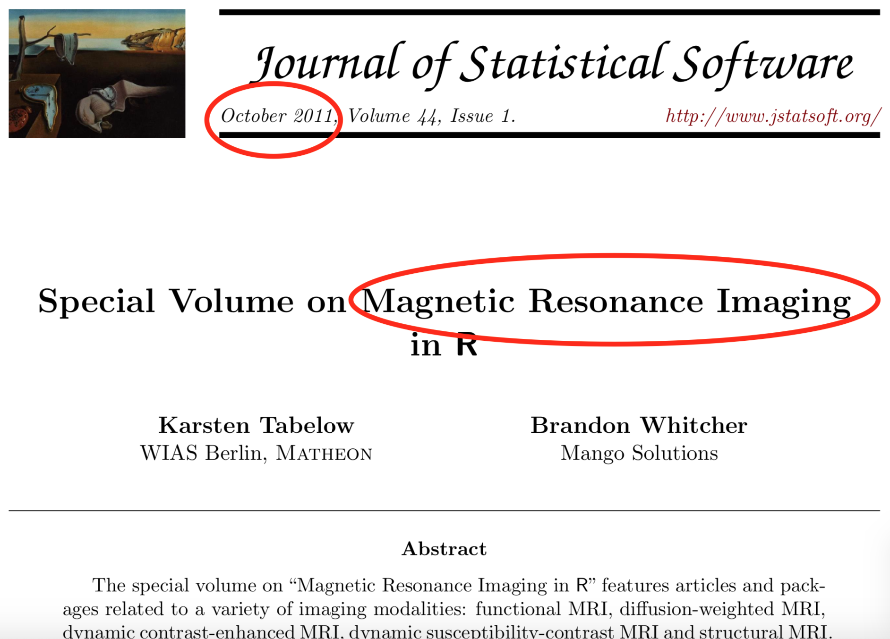
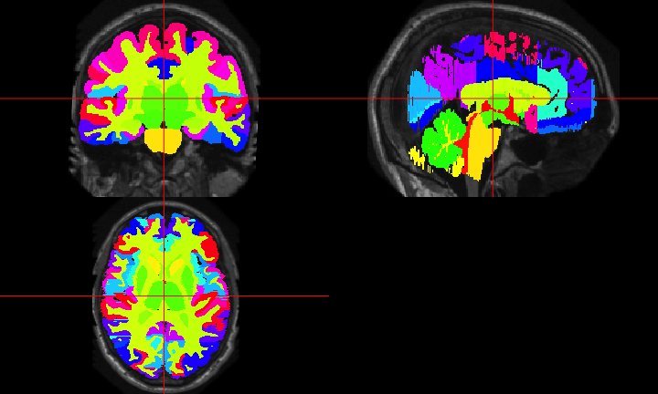

<style type="text/css">
article {
  font-size: 30pt;
}
</style>


# R is a language and environment <br>for **statistical** computing <br>and graphics. <br> https://cran.r-project.org/

# R is **much more** than that now, but...

## What did R have for medical imaging?

  <p style='font-size: 12pt;'> [https://imgflip.com/memegenerator/Grandma-Finds-The-Internet](https://imgflip.com/memegenerator/Grandma-Finds-The-Internet)
  </p>  


## What did R have for medical imaging?



## What did R have for medical imaging?

  


----
<div class="container"> 
<div id="left_col2"> 
  <h2>Workflow for an Analysis</h2>
<div style='font-size: 32pt;'>

- bash  
- FSL  
- ANTs  
- MRIcroGL  
- OsiriX  
- SPM 12  

</div>
  </div>    
  <div id="right_col2">

  </div>
</div>


----
<div class="container"> 
<div id="left_col2"> 
  <h2>Workflow for an Analysis</h2>
<div style='font-size: 32pt;'>
  
Multiple pieces of software used

  - all different syntax
</div>
  </div>    
  <div id="right_col2">

  </div>
</div>


----
<div class="container"> 
<div id="left_col2"> 
  <h2>Our Goal: </h2>
<div style='font-size: 24pt;'>
  
Lower the bar to entry 

- all "one" code (`R`)
    - pipeline tool
    - also "native" `R` code

Complete pipeline
  
  - preprocessing and analysis
</div>
  </div>    
  <div id="right_col2">

  </div>
</div>


## Envy: Bioconductor<br>  

- centralized bioinformatics packages (> 1300)
- large community/developer team
- published tutorials and workflows 
- additional requirements to CRAN (e.g. packages need vignettes)


# <br> An R Platform for <br> Medical Imaging Analysis


## What is Neuroconductor?

1.  A centralized repository of packages (N = 101)
2.  A community of developers (N = 27) and users
3.  A website [https://neuroconductor.org/](https://neuroconductor.org/).
    - with tutorials and help
4.  A team helping developers and users (John, Adi Gherman, Ciprian Crainiceanu, Brian Caffo)

## Benefits of Neuroconductor

<div style='font-size: 32pt;'>
  
Allow imaging to use all `R` has to offer:
  
- Statistics and Machine Learning (`tensorflow`)
- Versioning and testing (`GitHub`)
- Reproducible reports and analyses
- Shiny (web applications)
- Genomics/Imaging analysis in one platform
    - Bioconductor
  
</div>


## Goal: Centralize the packages (currently 101)


## New release (December 2019)


## Package Capabilites

- image registration: ANTsR, RNiftyReg, fslr
- inhomogeneity correction: fslr, ANTsR
- intensity normalization: WhiteStripe, RAVEL, ComBat (genomic)
- 3D smoothing: fslr, ANTsR, AnalyzeFMRI
- download/package data: kirby21.t1, kirby21.fmri, neurohcp, nitrcbot, Rxnat, malf.templates


----
<div class="container"> 
<div id="left_col2"> 
  <h2>Development Pipeline: </h2>
  
<div style='font-size: 28pt;'>
  
Check the package for stability

- check against other imaging software (e.g. FSL)

</div> 
  </p>
</div>    
  <div id="right_col2">
  
   
  </div>
</div>


----
<div class="container"> 
<div id="left_col2"> 
<h2>Neuroconductor Goal: </h2>

<div style='font-size: 28pt;'>

Detailed **tutorials** on how to actually perform an analysis  

</div> 
</div>    

<div id="right_col2">

<p style="font-size: 10pt;"> From [http://i.imgur.com/0Y1xISa.gifv](http://i.imgur.com/0Y1xISa.gifv).
</p>
</div>
</div>

</br></br></br></br>
</br></br></br></br>
<div class="container" style="width:100%">
http://johnmuschelli.com/neuroc
</div>

## Some (Unpopular?) Opinions

1. No code = no method...yet  "Available upon request" - not usually upheld
2. We are not the leaders in imaging
3. Not everyone cares about our methods
4. Many engineers are better in imaging at a) distributing code and b) selling their method
5. Most Academics (& depts) don't really support software well.


## Helping Developers

<div id="left_col" style="font-size: 28pt;">
- GitHub allows the Neuroconductor team to help fix issues
- Pull Requests to developers
- Standardized checking of Packages (Travis configuration)
- Remove unnecessary hurdles for developers
</div>
  <div id="right_col">
  
   
  <br>
  <br>
  <br>
  <div style="font-size: 10pt;">
Image from: https://giphy.com/gifs/medblr-medschool-dr-dres-anatomy-uRb2p09vY8lEs
</div>

  </div>
</div>


## Training we are providing

<div class="container"> 
   <div class="left-half" style="font-size: 28pt;">
   Coursera Course: Introduction to Neurohacking In R 
  </div>
  <div class="right-half" style="font-size: 28pt;">
  
  </div>
  </br></br></br></br>
https://www.coursera.org/learn/neurohacking/

<div style="font-size: 28pt;">
  http://johnmuschelli.com/imaging_in_r/
</div>
</div>


# Neuroimaging Analysis in Stroke

## The MISTIE Stroke Trial 

* Minimally Invasive Surgery plus r-tPA for Intracerebral Hemorrhage Evacuation (<strong>MISTIE</strong>) 
    - Multi-center, multi-national Phase II RCT
* Patients with intracerebral hemorrhages (≥ 20 millilters)


* http://braininjuryoutcomes.com/mistie-about


## What is Intracranial/Intracerebral hemorrhage?

<div class="columns-2" style='font-size: 28pt;'>
- When a blood vessel ruptures into:
    + **Tissue ⇒ intracerebral hemorrhage (ICH)**
    + Ventricles ⇒ intraventricular hemorrhage (IVH)
- ≈ 13% of strokes


<p style = "font-size:10.5px; ">
<a href = "http://www.heartandstroke.com/site/c.ikIQLcMWJtE/b.3484153/k.7675/Stroke__Hemorrhagic_stroke.htm" style ="word-wrap: break-word;" >http://www.heartandstroke.com/site/c.ikIQLcMWJtE/b.3484153/k.7675/Stroke__Hemorrhagic_stroke.htm</a>
</p>

</div>


## X-ray Computed Tomography (CT) Scans
<div class="notes">
Images are acquired from an X-ray scanner.  
x-ray goes around object and detector the other side of the object determines how many x-rays are recovered 
- fancy transform
- Image!
</div>
<div style="width:48%;float:left;">
<sub><sup><sub><sup>Image from http://www.cyberphysics.co.uk/topics/medical/CTScanner.htm</sup></sub></sup></sub>

<br>
</div>
<div style="margin-left:48%;">

</div>


## A note the MRI folks (about CT)

- CT has actual units (Hounsfield Units)
- CT is **the**  modality for clincial ICU imaging
- Takes seconds vs. minutes (MRI)
- Muschelli, J., 2019. Recommendations for Processing Head CT Data. Frontiers in neuroinformatics, 13, p.61.
- https://johnmuschelli.com/process_head_ct/example/

## {#margins}

<div class="container" style="margin-top: -60px;"> 
   <div class="left-half2" style="font-size: 24pt;">
Muschelli, J., Sweeney, E. M., Ullman, N. L., Vespa, P., Hanley, D. F., & Crainiceanu, C. M. (2017). **PItcHPERFeCT**: Primary intracranial hemorrhage probability estimation using random forests on CT. *NeuroImage: Clinical*, 14, 379-390.
  </div>
  <div class="right-half2" style="font-size: 28pt;">
  
  </div>
</div>


## <a href="https://neuroconductor.org/package/ichseg">ichseg: ICH Segmentation on CT</a> 
```r
ichseg::ich_segment(img = "/path/to/ct/scan")
```


## Things in the Works

<div class="container"> 
   <div class="left-half" style="font-size: 28pt;">
  https://github.com/ANTsXNet - Deep Learning
  </div>
  <div class="right-half" style="font-size: 28pt;">
  
  </div>
</div>


## Questions?

Email:


Submit Packages at: https://neuroconductor.org/submit-package

Funding: NIH 2R01NS060910 and U24HG010263


## neurohcp: Human Connectome Project 

- Allows you to download data from [Human Connectome Project](https://www.humanconnectome.org/)
- The 1200 Subjects release: behavioral and 3T MR imaging data from 1206 healthy young adult participants.  Standardized protocol.
- Tutorial: http://johnmuschelli.com/neuroc/neurohcp


## rcamino: Port of Camino Software

- Wraps [Camino Diffusion MRI Toolkit](http://camino.cs.ucl.ac.uk/)
- Takes in b-values, b-vectors, and tensors
- Fits models for DTI data
- http://johnmuschelli.com/neuroc/DTI_analysis_rcamino/index.html


## malf.templates: Segmented T1-weighted Images 
<div style='font-size: 20pt;'>
- Data from the MICCAI 2012 Challenge on Multi-atlas Labelling Data
- From OASIS project and the labeled data as provided by
Neuromorphometrics, Inc. (http://Neuromorphometrics.com/) 
</div>

<!-- -->

## MALF: Skull Stripping Example

<div class="container">
  <div class="left-half"> 
From [@mass]:


</div>
  <div class="right-half"> 

- Register templates to an subject T1 
- Apply transformation to the label/mask, average over voxels
    - there are "smarter" (e.g. weighted) ways
</div>
</div>


