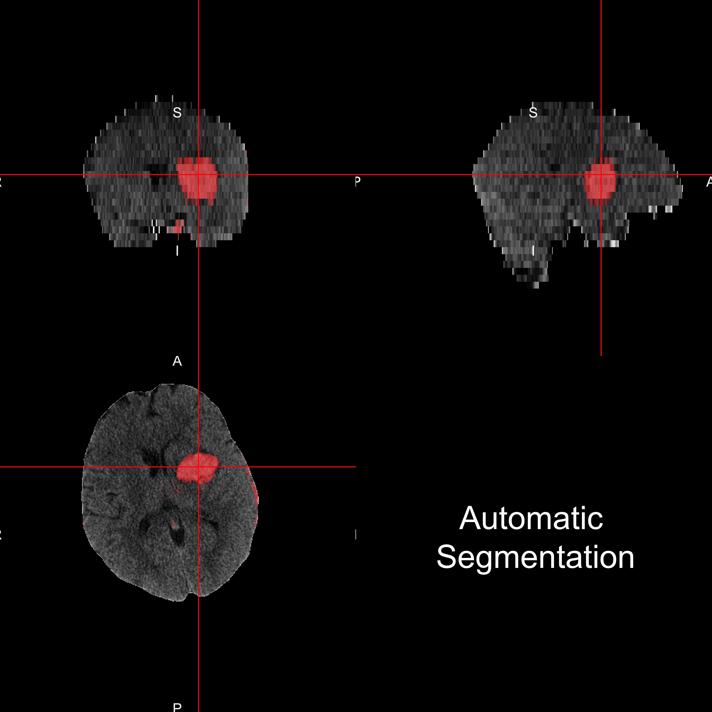

<script type="text/x-mathjax-config">
MathJax.Hub.Config({ TeX: { extensions: ["color.js"] }});
</script>

```{r opts, prompt=FALSE, echo=FALSE, message=FALSE, warning=FALSE, error=FALSE, comment=""}
library(knitr)
library(knitcitations)
cite_options(max.names = 1)
opts_chunk$set(echo = FALSE, prompt = FALSE, message = FALSE, warning = FALSE, comment = "", results = 'hide')
```


```{r setup, prompt=TRUE, echo=FALSE, message=FALSE, warning=FALSE}
rm.obj = ls()
rm.obj = rm.obj[ !(rm.obj %in% c("fname", "slide"))]
rm(list = rm.obj)
library(pander)
options(stringsAsFactors = FALSE)
# rootdir = path.expand("~/Dropbox/CTR/DHanley/MISTIE")
# homedir = file.path(rootdir, "ICH Analysis")
# Mdir = file.path(rootdir, "MISTIE DSMB Analysis")
# resdir <- file.path(homedir, "results")
# rundir <- file.path(resdir, "Manuscript")
# progdir <- file.path(homedir, "stataprograms")
# datadir <- file.path(Mdir, "statacalc")
# load(file=file.path(rundir, "Randomized_Patients.Rda"))
load(file = "All_IncludingICES_Patients.Rda")
load(file = "111_Filenames.Rda")
pt.ids = c(100318L, 100362L, 100365L, 101306L, 101307L, 101308L, 102317L, 
102322L, 102324L, 102331L, 102360L, 102367L, 102374L, 102391L, 
102393L, 102403L, 102406L, 120376L, 131310L, 131316L, 131334L, 
131354L, 133409L, 133417L, 134304L, 134305L, 134320L, 134327L, 
134345L, 134380L, 134381L, 134382L, 134392L, 134408L, 134412L, 
134416L, 152302L, 152303L, 152353L, 157328L, 157329L, 157332L, 
157335L, 157336L, 157370L, 157372L, 157399L, 157410L, 161413L, 
173312L, 173313L, 173325L, 173341L, 173361L, 173364L, 173368L, 
173384L, 173396L, 173404L, 175387L, 175397L, 175405L, 179373L, 
179383L, 179386L, 179394L, 179395L, 179402L, 184388L, 191301L, 
191311L, 191314L, 191315L, 191319L, 191321L, 191333L, 191375L, 
191400L, 205509L, 205517L, 205519L, 216390L, 219350L, 222337L, 
222357L, 222358L, 223355L, 223369L, 223407L, 225502L, 225503L, 
225504L, 225505L, 225506L, 225507L, 225510L, 225511L, 225515L, 
225524L, 230356L, 230363L, 230366L, 230371L, 230377L, 232514L, 
232516L, 234385L, 265389L, 265398L, 289518L, 289525L)
fdf$id = as.numeric(gsub("-", "", fdf$id))
fdf = fdf[ fdf$id %in% pt.ids, ]
```

```{r demog}
library(tableone)
library(pander)
library(plyr)
alldemog = read.csv("All_180_FollowUp_wDemographics.csv", as.is = TRUE)
alldemog = alldemog[, c("patientName", "Clot_Location_RC")]
alldemog$Clot_Location_RC = plyr::revalue(
  alldemog$Clot_Location_RC,
  c("Globus Palidus" = "Globus Pallidus"))
n.ids = length(unique(fdf$id))
demog = fdf$id 

demog = all.alldat[ all.alldat$patientName %in% demog, ]
demog$Clot_Location_RC = NULL
demog = merge(demog, alldemog, all.x = TRUE )
stopifnot(nrow(demog) == n.ids)
demog$Diagnostic_ICH_Volume =demog$ICH_Dx_10 * 10 
demog$Diagnostic_IVH_Volume =demog$IVH_Dx_10 * 10 
tt = sort(table(demog$Clot_Location_RC), decreasing = TRUE)
nclot = names(tt)[tt > 0]
demog$Clot_Location_RC = factor(demog$Clot_Location_RC, levels = nclot)

vars = c("Age", "Gender", "Clot_Location_RC",
         "Diagnostic_ICH_Volume")
catvars = c("Gender", "Clot_Location_RC")
tb1 = CreateTableOne(vars = vars, factorVars = catvars, 
                     data = demog)
tb1 = print(tb1, contDigits = 1)
gen = grepl("Gender", rownames(tb1))
rownames(tb1)[ gen ] = "Male: N (%)"
tb1[gen,1] = gsub("\\((.*)\\)", "(\\1%)", tb1[gen,1,drop=FALSE])

rownames(tb1) = gsub("_", " ", rownames(tb1))
rownames(tb1) = gsub(" \\(mean", ": Mean", rownames(tb1))
rownames(tb1) = gsub("(sd))", "(SD)", rownames(tb1), fixed=TRUE)
rownames(tb1) = gsub("Volume", "Volume in mL", rownames(tb1), fixed=TRUE)
rownames(tb1) = gsub("Diagnostic", "", rownames(tb1), fixed=TRUE)
rownames(tb1) = gsub("Age", "Age in Years", rownames(tb1), fixed=TRUE)
rownames(tb1) = gsub("Clot_Location_RC", "ICH Location", rownames(tb1), fixed=TRUE)
tb1 = tb1[rownames(tb1) != "n", , drop=FALSE]
# tb1 = pander.return(tb1)
# tb1 = tb1[ tb1 != ""]
```

```{r}
library(RefManageR)
library(knitcitations)
bib <- ReadBib('Oral_Proposal.bib')
x = sapply(bib, citep)
```


## The MISTIE Stroke Trial 

* Minimally Invasive Surgery plus r-tPA for Intracerebral Hemorrhage Evacuation (<strong>MISTIE</strong>) 
    - Multi-center, multi-national Phase II clinical trial
    - MISTIE III ongoing 

<div class="container">
<div id="left_col">

</div>
<div id="right_col">
PI: Dr. Dan Hanley

</div>
</div>

* http://braininjuryoutcomes.com/mistie-about


## Intracranial/Intracerebral Hemorrhage (ICH)

<div class="container" style='font-size: 28pt;'> 
   <div id="left_col">


<p style = "font-size:10.5px; ">
<a href = "http://www.heartandstroke.com/site/c.ikIQLcMWJtE/b.3484153/k.7675/Stroke__Hemorrhagic_stroke.htm" style ="word-wrap: break-word;" >http://www.heartandstroke.com/site/c.ikIQLcMWJtE/b.3484153/k.7675/Stroke__Hemorrhagic_stroke.htm</a>
</p>

</div>
   <div id="right_col">

- When a blood vessel ruptures into tissue
- ≈ 13% of strokes


  </div>

</div>


## Manual Segmentation: Tracings on CT Scans

<div class="columns-2">

<br/>

</div>


---- 
<div class="container"> 
<div id="left_col2"> 
  <h2>Workflow for the Analysis</h2>
  </div>    
  <div id="right_col2">

  </div>
</div>

## Automatic Segmentation

<div class="columns-2">

<br/>

</div>


---- 
<div class="container"> 
<div id="left_col2"> 
  <h2>Workflow for the Analysis</h2>
<div style='font-size: 32pt;'>
  
Multiple pieces of software used

  - all different syntax

</div>  
  </div>    
  <div id="right_col2">

  </div>
</div>


#  Neuroconductor: <br> A Framework for Reproducible Neuroimaging Analysis <br> in R


---- 
<div class="container"> 
<div id="left_col2"> 
  <h2>Neuroconductor Workflow for the Analysis</h2>
  </div>    
  <div id="right_col2">

  </div>
</div>
