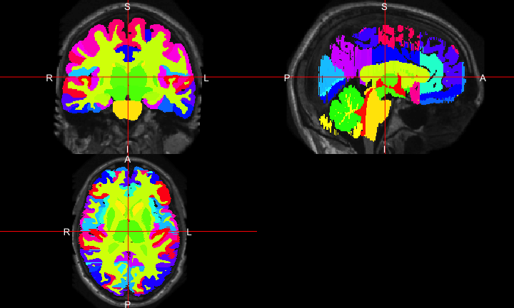
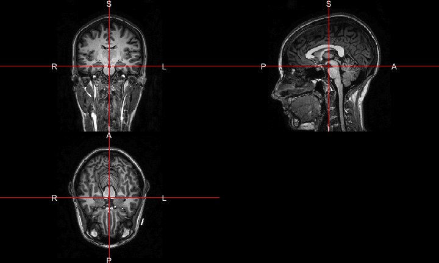

# Medical Image Analysis in R
John Muschelli<br/>http://johnmuschelli.com/Multimodal_Workshop.html<br/> Johns Hopkins Bloomberg School of Public Health  
<style type="text/css">
article {
  font-size: 30pt;
}
</style>


# R is a language and environment <br>for **statistical** computing <br>and graphics. <br> https://cran.r-project.org/

## R is a base set of foundational functions {.centered}

 

## With by user-written packages of functions {.centered}


 


## Benefits of R

- Free, open-source
- Cross-platform
- Over 11000 packages
- Taught by stat/biostat departments
- Packaging system is good (well-documented, tested, relatively-understandable)
- RStudio - company and software


# Everything that exists is an object.<br> Everything that happens is a function call.<br> [@chambers2014object]

## For example:


## Plotting orthographic

<!-- -->


## Inspiration<br>  

- centralized bioinformatics/genomics packages
- large community/number of packages (> 1300)
- published tutorials and workflows 
- additional requirements to CRAN (e.g. packages need vignettes)


## Inspiration<br>  

- team of developers/maintainers
- multiple grants of support 

# Neuroconductor: An R Platform for Medical Imaging Analysis

## Inspiration 

- integrates multiple neuroimaging software
- standardizes the syntax
- provides workflows
- allows the user to take advantage of all of Python
    - pandas, scikit-learn, Jupyter notebooks


## Inspiration: SPM/MATLAB has GUI + courses!<br> 


## What did R have?

  <p style='font-size: 12pt;'> [https://imgflip.com/memegenerator/Grandma-Finds-The-Internet](https://imgflip.com/memegenerator/Grandma-Finds-The-Internet)
  </p>  


## What did R have?

  
  


# <br> An R Platform for <br> Medical Imaging Analysis


## What **really** is Neuroconductor?

1.  A community of developers and users of R packages for imaging
2.  A website [https://neuroconductor.org/](https://neuroconductor.org/).
    - with tutorials and help
3.  A team helping developers and users (John, Adi Gherman, Ciprian Crainiceanu, Brian Caffo)
4.  A centralized repository of maintained packages


## Goal: Centralize the packages (currently 56)

  


----
<div class="container"> 
<div id="left_col2"> 
<h2>Neuroconductor Goal: </h2>

<div style='font-size: 28pt;'>

Detailed **tutorials** on how to actually perform an analysis  

</br>

- [http://johnmuschelli.com/neuroc](http://johnmuschelli.com/neuroc/)  

</div> 
</div>    
<div id="right_col2">

<p style='font-size: 10pt;'> From [http://i.imgur.com/0Y1xISa.gifv](http://i.imgur.com/0Y1xISa.gifv).
</p>
</div>
</div>


----
<div class="container"> 
<div id="left_col2"> 
  <h2>Workflow for an Analysis</h2>
<div style='font-size: 32pt;'>

- bash  
- FSL  
- ANTs  
- MRIcroGL  
- OsiriX  
- SPM 12  

</div>
  </div>    
  <div id="right_col2">

  </div>
</div>


----
<div class="container"> 
<div id="left_col2"> 
  <h2>Workflow for an Analysis</h2>
<div style='font-size: 32pt;'>
  
Multiple pieces of software used

  - all different syntax
</div>
  </div>    
  <div id="right_col2">

  </div>
</div>


## It's typical to have lots of software choices


<!--  -->

Carp, Joshua. "The secret lives of experiments: methods reporting in the fMRI literature." Neuroimage 63.1 (2012): 289-300.

----
<div class="container"> 
<div id="left_col2"> 
  <h2>Goal: </h2>
<div style='font-size: 24pt;'>
  
Lower the bar to entry 

- all R code
    - pipeline tool
    - "native" R code

Complete pipeline
  
  - preprocessing and analysis
</div>
  </div>    
  <div id="right_col2">

  </div>
</div>

## Using R as a Pipeline Tool: fslr

- `fslr` package - call FSL from R

- Requires FSL to be installed and in PATH
    - FSL only available on Unix-style systems


## Why not CRAN: The story of ANTsR

ANTs: Advanced Normalization Tools

- State-of-the-art image processing pipelines
- Built at UPenn under Brian Avants
    - Group has won challenges for imaging analysis
- Still actively maintained and developed
- Depends on the Insight ToolKit (ITK) medical image processing library


## The story of ANTsR: Porting ANTs to R 

- Group tried to wrap C++ code with Rcpp for it to work "seamlessly" with R
- [Had some issues with CRAN](https://github.com/stnava/ANTsR/issues/8)
- Most developers response: "just make it work"
- **NOT** like `fslr` - this built the libraries and could be called using `.Call`
    - possible (not yet) to use on Windows

## Why not CRAN: Dependencies

- ANTsR depends on `CMake`: 
- ANTsR also depends on ITKR - large code base
- External dependencies are not always welcome
- [CRAN response](https://stat.ethz.ch/pipermail/r-package-devel/2015q2/000106.html):  (more or less)

## Why not CRAN: Checks

- We would like more stringent checks than CRAN (like vignettes) like Bioconductor
- But **also** more lenient ones 
  - Examples may take > 5 seconds to compile
  - Time to build package may take a while
  - May not work on Windows if not applicable

## Why not CRAN: Data

Medical images are big (> 5 mb) compared to code

**CRAN doesn't like this**

- Example data packages are harder to get passed
- We got `kirby21.t1` and `kirby21.fmri`, but they have an implicit downloader function in the code
- Necessary for testing code examples in imaging
  - **STANDARDIZED** file location (`system.file`)

# Solution: Build a Bioconductor-like Solution using Current Tools

## Git and GitHub

- Git version control system: stores changes of files 
 

- GitHub is an **online** server of repositories
- Distribute packages and install them via `devtools::install_github`

 

## Continuous Integration: Travis and Appveyor

- Builds and checks R packages on Windows (Appveyor) and Linux/OS X (Travis CI)
- Works well with GitHub

 &emsp;&emsp;&emsp;  

----
<div class="container"> 
<div id="left_col2"> 
  <h2>Development Pipeline: </h2>
  
<div style='font-size: 28pt;'>
  
Check the package for stability

- check against other imaging software (e.g. FSL)

</div> 
  </p>
</div>    
  <div id="right_col2">
  
   
  </div>
</div>


## ANTsR Revisited: Helping Developers

- GitHub allows the Neuroconductor team to help fix issues
- Standardized ANTsR checking for NeuroC
- Pull Requests to Group ICA package (Brian Caffo)
- Remove unnecessary hurdles for developers

## Neuroconductor Capabilities


Capabilities               Packages                                   
-------------------------  -------------------------------------------
DICOM Images               oro.dicom, dcm2niir, divest, ANTsR         
NIfTI Images               oro.nifti, RNifti, ANTsR                   
Image Registration         spm12r, fslr, ANTsR, freesurfer            
Inhomogeneity Correction   spm12r, fslr, ANTsR                        
Brain Extraction           spm12r, fslr, ANTsR, extrantsr             
Structure Segmentation     spm12r, fslr, ANTsR, extrantsr, freesurfer 
Intensity Normalization    WhiteStripe, neurobase, ANTsR              
3D Smoothing               ANTsR, spm12r, fslr                        
Temporal Filtering         spm12r, fslr, ANTsR                        
Slice-timing correction    spm12r, fslr                               
DTI models                 rcamino, oro.dti, fslr                     


## Benefits of Neuroconductor: 

<div style='font-size: 32pt;'>
  
Allow imaging to use all R has to offer:
  
- Statistics and Machine Learning
- Versioning and testing
- Reproducibile reports and analyses
- Shiny (web applications)
- Genomics/Imaging analysis in one platform
    - Bioconductor
  
</div>


##  Neuroconductor Downsides

<div style='font-size: 28pt;'>

1.  More control over the workflow = more work
2.  Users need external software (versions/installation)
3.  No control over external software
    - if maintainer changes something, not much recourse
4.  Need the content (buy-in from the community)

</div>

----
<div class="container"> 
<div id="left_col2"> 
  <h2>Potential Neuroconductor Downsides: </h2>
<div style='font-size: 24pt;'>

Enabling statisticians to do preprocessing also **enables** imagers to do advanced statistics.

- Why enlist us for only this part?

</div>
  </div>    
  <div id="right_col2">

  </div>
</div>


## Training we are providing

<div class="container"> 
   <div class="left-half" style="font-size: 28pt;">
   Coursera Course: Introduction to Neurohacking In R 
  </div>
  <div class="right-half" style="font-size: 28pt;">
  
  </div>
[https://www.coursera.org/learn/neurohacking/](https://www.coursera.org/learn/neurohacking/)

<div style="font-size: 28pt;">
   Neuroimaging analysis within R (ISBI, Melbourne, April 2017)

   ENAR 2018
</div>
</div>


# Without Knowing the Processing,<br> Analyses Cannot be Trusted

# No Code = No Method

# Current Neuroconductor Packages Overviews

## dcm2niir and divest: Converting DICOM data

- `dcm2nii` by Dr. Chris Rorden
    - jackknife for almost any DICOM type to NIfTI
- `dcm2niir` wraps a binary executable of dcm2nii
    - calls the command prompt (not always Windows-friendly)
- `divest` wraps the background C++ code of dcm2nii
    - runs in "native" R

## neurohcp: Human Connectome Project 

- Allows you to download data from [Human Connectome Project](https://www.humanconnectome.org/)
- The 1200 Subjects release: behavioral and 3T MR imaging data from 1206 healthy young adult participants.  Standardized protocol.
- Tutorial: http://johnmuschelli.com/neuroc/neurohcp


## spm12r: Wrapper Functions for SPM

- Wraps some MATLAB code to call SPM scripts
- Built from SPM batch commands
- `spm12_slice_timing`, `spm12_realign`
- `spm12_coregister`, `spm12_segment`
- `spm12_normalize`, `spm12_smooth`
- http://johnmuschelli.com/neuroc/fmri_analysis_spm12r/index.html

## rcamino: Port of Camino Software

- Wraps [Camino Diffusion MRI Toolkit](http://camino.cs.ucl.ac.uk/)
- Takes in b-values, b-vectors, and tensors
- Fits models for DTI data
- http://johnmuschelli.com/neuroc/DTI_analysis_rcamino/index.html


## extrantsr: Extra functions for ANTsR

- Wraps `ANTsR` functions for nifti objects (from oro.nifti)
- `malf` function - performs a basic MALF algorithm
- `within_visit_registration` - performs within-visit registration for structural MRI
- `preprocess_mri_within` - pipeline to process within-visit sMRI


## malf.templates: Segmented T1-weighted Images 

- Data from the MICCAI 2012 Challenge on Multi-atlas Labelling Data
- From OASIS project and the labeled data as provided by
Neuromorphometrics, Inc. (http://Neuromorphometrics.com/) 
- Have T1-weighted image, brain mask, image with mask applied, substructure segmentation
    - Hand segmented structures - useful for multi-atlas label fusion (MALF)


## malf.templates: Segmented T1-weighted Images 

<!-- -->

## MALF: Skull Stripping Example

<div class="container">
  <div class="left-half"> 
From [@mass]:


</div>
  <div class="right-half"> 

- Register templates to an subject T1 
- Apply transformation to the label/mask, average over voxels
    - there are "smarter" (e.g. weighted) ways
</div>
</div>


## Neuroconductor installer:

Provide an installer to download the current packages: 


```r
source("https://neuroconductor.org/neurocLite.R")
neurocLite("kirby21.fmri")
neurocLite("neurobase")
neurocLite("ANTsR")
```


## `kirby21.fmri`: fMRI data from Kirby21


```r
library(kirby21.t1) # load T1 data
library(kirby21.fmri) # load fMRI data
library(kirby21.base) # helper package to download data
library(neurobase) # neuroconductor base package
fnames = get_image_filenames_list(
  modalities = c("fMRI", "T1"), id = 113, visit = 1)
print(fnames)
t1_fname = fnames$T1 
fmri_fname = fnames$fMRI
```

```
                                                 fMRI 
"library/kirby21.fmri/visit_1/113/113-01-fMRI.nii.gz" 
                                                   T1 
    "library/kirby21.t1/visit_1/113/113-01-T1.nii.gz" 
```

## Plot the T1

<!-- -->

<!-- ## A DTI Example -->

<!-- - Download the Diffusion data for an HCP subject -->

<!-- ```{r eval = FALSE, echo = TRUE} -->
<!-- library(neurohcp) -->
<!-- result = download_hcp_dir("HCP/100307/T1w/Diffusion", verbose = FALSE) -->
<!-- print(basename(result$output_files)) -->
<!-- ```` -->

<!-- ```{r, eval = TRUE, echo = FALSE} -->
<!-- result = list(output_files = c("bvals", "bvecs", "data.nii.gz", "grad_dev.nii.gz", "nodif_brain_mask.nii.gz") -->
<!-- ) -->
<!-- result$output_files -->
<!-- ``` -->

<!-- ## Fit a DTI Model -->

<!-- ```{r eval = FALSE} -->
<!-- # Extract the DTI files for the subject and name them using the NIfTI format -->
<!-- library(neurobase) -->
<!-- library(rcamino) -->
<!-- outfiles <- result$output_files -->
<!-- names(outfiles) <- neurobase::nii.stub(basename(outfiles)) -->

<!-- # Specify the B-values and B-vectors used in the HCP database for further processing: -->
<!-- camino_fsl2scheme(bvecs = outfiles[["bvecs"]], bvals = outfiles[["bvals"]], -->
<!--     outfile = "hcp.scheme") -->

<!-- # Convert the diffusion data from NIfTI to Camino format: -->
<!-- camino_image2voxel(infile = outfiles[["data"]], outfile = "dwi.Bfloat") -->

<!-- # Fit the diffusion tensor imaging model: -->
<!-- camino_modelfit(infile = "dwi.Bfloat", outfile = "dt.Bdouble",  -->
<!--     scheme = "hcp.scheme", gradadj = outfiles[["grad_dev"]], -->
<!--     model = "ldt", mask = outfiles[["nodif_brain_mask"]]) -->

<!-- # Produce the FA and MD maps from the fitted tensor data: -->
<!-- fa <- camino_fa_img(infile = "dt.Bdouble", inputmodel = "dt", header = outfiles[["data"]]) -->
<!-- md <- camino_md_img(infile = "dt.Bdouble", inputmodel = "dt", header = outfiles[["data"]]) -->
<!-- ``` -->


## Future work
  - F1000 R packages channel - get publication for workflow
  - Removing dupliate packages from CRAN - like Bioconductor
  - Docker image for Neuroconductor:    
    - have all dependencies/external software in one container

## Go to

http://johnmuschelli.com/imaging_in_r/index.html

Example MPRAGE T1 image can be found at [http://bit.ly/pittimg](http://bit.ly/pittimg)

Download the `.R` file
[http://bit.ly/pittscript](http://bit.ly/pittscript)

fMRI in Shiny
[http://bit.ly/shinybrain](http://bit.ly/shinybrain)

Papaya Example
[http://bit.ly/pittpapaya](http://bit.ly/pittpapaya)

## References
