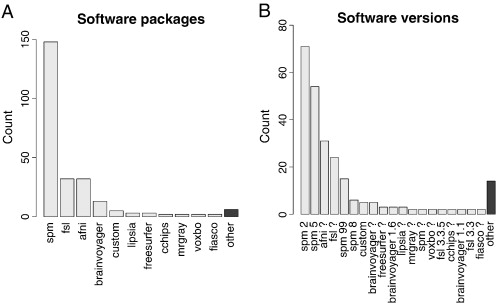

# Medical Image Analysis in R
John Muschelli<br/>http://johnmuschelli.com/Multimodal_Workshop.html<br/> Johns Hopkins Bloomberg School of Public Health  
<style type="text/css">
article {
  font-size: 30pt;
}
</style>


# R is a language and environment <br>for **statistical** computing <br>and graphics. <br> https://cran.r-project.org/

## R is a base set of foundational functions {.centered}

 

## With by user-written packages of functions {.centered}

 


## Benefits of R

- Free, open-source
- Cross-platform
- Over 11000 packages
- Taught by stat/biostat departments
- Packaging system is good (well-documented, tested, relatively-understandable)
- RStudio - company and software


# Everything that exists is an object.<br> Everything that happens is a function call.<br> [@chambers2014object]

## For example:


```r
library(neurobase)
library(fslr)
img = readrpi("anat.nii.gz", verbose = FALSE)
```


## Plotting orthographic


```r
ortho2(img)
```


----
<div class="container"> 
<div id="left_col2"> 
  <h2>Workflow for an Analysis</h2>
<div style='font-size: 32pt;'>

- bash  
- FSL  
- ANTs  
- MRIcroGL  
- OsiriX  
- SPM 12  

</div>
  </div>    
  <div id="right_col2">

  </div>
</div>


----
<div class="container"> 
<div id="left_col2"> 
  <h2>Workflow for an Analysis</h2>
<div style='font-size: 32pt;'>
  
Multiple pieces of software used

  - all different syntax
</div>
  </div>    
  <div id="right_col2">

  </div>
</div>


## It's typical to have lots of software choices



<!--  -->

Carp, Joshua. "The secret lives of experiments: methods reporting in the fMRI literature." Neuroimage 63.1 (2012): 289-300.

----
<div class="container"> 
<div id="left_col2"> 
  <h2>My Goal: </h2>
<div style='font-size: 24pt;'>
  
Lower the bar to entry 

- all R code
    - pipeline tool
    - "native" R code

Complete pipeline
  
  - preprocessing and analysis
</div>
  </div>    
  <div id="right_col2">

  </div>
</div>


## What did R have?

  <p style='font-size: 12pt;'> [https://imgflip.com/memegenerator/Grandma-Finds-The-Internet](https://imgflip.com/memegenerator/Grandma-Finds-The-Internet)
  </p>  


## What did R have?

  
  

## Bioinformatics Repository: Bioconductor<br>  

## Bioinformatics Repository: Bioconductor<br>  

- centralized bioinformatics/genomics packages
- large community/number of packages (> 1300)
- published tutorials and workflows 
- additional requirements to CRAN (e.g. packages need vignettes)


## Bioinformatics Repository: Bioconductor<br>  

- team of developers/maintainers
- multiple grants of support 

## Python Framework: NiPy 

- integrates multiple neuroimaging software
- standardizes the syntax
- provides workflows
- allows the user to take advantage of all of Python
    - pandas, scikit-learn, Jupyter notebooks


# <br> An R Platform for <br> Medical Imaging Analysis


## What is Neuroconductor?

1.  A community of developers and users of R packages for imaging
2.  A website [https://neuroconductor.org/](https://neuroconductor.org/).
    - with tutorials and help
3.  A team helping developers and users (John, Adi Gherman, Ciprian Crainiceanu, Brian Caffo)
4.  A centralized repository of maintained packages


## Goal: Centralize the packages (currently 56)

  


----
<div class="container"> 
<div id="left_col2"> 
<h2>Neuroconductor Goal: </h2>

<div style='font-size: 28pt;'>

Detailed **tutorials** on how to actually perform an analysis  

</br>

- [http://johnmuschelli.com/neuroc](http://johnmuschelli.com/neuroc/)  

</div> 
</div>    
<div id="right_col2">

<p style='font-size: 10pt;'> From [http://i.imgur.com/0Y1xISa.gifv](http://i.imgur.com/0Y1xISa.gifv).
</p>
</div>
</div>


# Solution: Build a Bioconductor-like Solution using Current Tools

## Git and GitHub

- Git version control system: stores changes of files 
 

- GitHub is an **online** server of repositories
- Distribute packages and install them via `devtools::install_github`

 

## Continuous Integration: Travis and Appveyor

- Builds and checks R packages on Windows (Appveyor) and Linux/OS X (Travis CI)
- Works well with GitHub

 &emsp;&emsp;&emsp;  

----
<div class="container"> 
<div id="left_col2"> 
  <h2>Development Pipeline: </h2>
  
<div style='font-size: 28pt;'>
  
Check the package for stability

- check against other imaging software (e.g. FSL)

</div> 
  </p>
</div>    
  <div id="right_col2">
  
   
  </div>
</div>


## Helping Developers

- GitHub allows the Neuroconductor team to help fix issues
- Pull Requests to developers
- Standardized checking of Packages (Travis configuration)
- Remove unnecessary hurdles for developers


## Neuroconductor installer:

Provide an installer to download the current packages: 


```r
source("https://neuroconductor.org/neurocLite.R")
neurocLite("kirby21.fmri")
neurocLite("neurobase")
neurocLite("ANTsR")
```

## Neuroconductor Capabilities


Capabilities               Packages                                   
-------------------------  -------------------------------------------
DICOM Images               oro.dicom, dcm2niir, divest, ANTsR         
NIfTI Images               oro.nifti, RNifti, ANTsR                   
Image Registration         spm12r, fslr, ANTsR, freesurfer            
Inhomogeneity Correction   spm12r, fslr, ANTsR                        
Brain Extraction           spm12r, fslr, ANTsR, extrantsr             
Structure Segmentation     spm12r, fslr, ANTsR, extrantsr, freesurfer 
Intensity Normalization    WhiteStripe, neurobase, ANTsR              
3D Smoothing               ANTsR, spm12r, fslr                        
Temporal Filtering         spm12r, fslr, ANTsR                        
Slice-timing correction    spm12r, fslr                               
DTI models                 rcamino, oro.dti, fslr                     


## Benefits of Neuroconductor: 

<div style='font-size: 32pt;'>
  
Allow imaging to use all R has to offer:
  
- Statistics and Machine Learning
- Versioning and testing
- Reproducibile reports and analyses
- Shiny (web applications)
- Genomics/Imaging analysis in one platform
    - Bioconductor
  
</div>


##  Neuroconductor Downsides

<div style='font-size: 28pt;'>

1.  More control over the workflow = more work
2.  Users need external software (versions/installation)
3.  No control over external software
    - if maintainer changes something, not much recourse
4.  Need the content (buy-in from the community)

</div>

----
<div class="container"> 
<div id="left_col2"> 
  <h2>Potential Neuroconductor Downsides: </h2>
<div style='font-size: 24pt;'>

Enabling statisticians to do preprocessing also **enables** imagers to do advanced statistics.

- Why enlist us for only this part?

</div>
  </div>    
  <div id="right_col2">

  </div>
</div>


## Training we are providing

<div class="container"> 
   <div class="left-half" style="font-size: 28pt;">
   Coursera Course: Introduction to Neurohacking In R 
  </div>
  <div class="right-half" style="font-size: 28pt;">
  
  </div>
[https://www.coursera.org/learn/neurohacking/](https://www.coursera.org/learn/neurohacking/)

<div style="font-size: 28pt;">
   Neuroimaging analysis within R (ISBI, Melbourne, April 2017)

   ENAR 2018
</div>
</div>


# Without Knowing the Processing,<br> Analyses Cannot be Trusted

# Example Packages

## Using R as a Pipeline Tool: fslr

- `fslr` package - call FSL from R

- Requires FSL to be installed and in PATH
    - FSL only available on Unix-style systems


## RNifti

- provides lightweight objects as C++ pointers (fast operations)
- Wrapped in Rcpp: Works on all platforms

## RNiftyReg

- Registration of Images
- Wrapped in Rcpp: Works on all platforms

## ANTsR

Based on ANTs: Advanced Normalization Tools

- State-of-the-art image processing pipelines
- Built at UPenn under Brian Avants
    - Group has won challenges for imaging analysis
- Still actively maintained and developed
- Depends on the Insight ToolKit (ITK) medical image processing library

## dcm2niir and divest: Converting DICOM data

- `dcm2nii` by Dr. Chris Rorden
    - jackknife for almost any DICOM type to NIfTI
- `dcm2niir` wraps a binary executable of dcm2nii
    - calls the command prompt (not always Windows-friendly)
- `divest` wraps the background C++ code of dcm2nii
    - runs in "native" R

## neurohcp: Human Connectome Project 

- Allows you to download data from [Human Connectome Project](https://www.humanconnectome.org/)
- The 1200 Subjects release: behavioral and 3T MR imaging data from 1206 healthy young adult participants.  Standardized protocol.
- Tutorial: http://johnmuschelli.com/neuroc/neurohcp


## rcamino: Port of Camino Software

- Wraps [Camino Diffusion MRI Toolkit](http://camino.cs.ucl.ac.uk/)
- Takes in b-values, b-vectors, and tensors
- Fits models for DTI data
- http://johnmuschelli.com/neuroc/DTI_analysis_rcamino/index.html


## extrantsr: Extra functions for ANTsR

- Wraps `ANTsR` functions for `nifti` objects (from oro.nifti)
- `malf` function - performs a basic MALF algorithm
- `within_visit_registration` - performs within-visit registration for structural MRI
- `preprocess_mri_within` - pipeline to process within-visit sMRI


## `kirby21.t1`/`kirby21.fmri`: fMRI data from Kirby21

- data from @landman2011multi
    - 21 subjects scanned twice, multiple modalities
- provides 3 subjects for testing/examples/etc.
- https://www.nitrc.org/projects/multimodal)


## malf.templates: Segmented T1-weighted Images 
<div style='font-size: 20pt;'>
- Data from the MICCAI 2012 Challenge on Multi-atlas Labelling Data
- From OASIS project and the labeled data as provided by
Neuromorphometrics, Inc. (http://Neuromorphometrics.com/) 
</div>

<!-- -->

## MALF: Skull Stripping Example

<div class="container">
  <div class="left-half"> 
From [@mass]:


</div>
  <div class="right-half"> 

- Register templates to an subject T1 
- Apply transformation to the label/mask, average over voxels
    - there are "smarter" (e.g. weighted) ways
</div>
</div>


## `spant`: MR Spectroscopy Analysis Tools

- Metabolite combination analysis
- Non-brain imaging!


## `lungct`: tools for Lung CT analysis

- Non-brain imaging!
- Not MR!

## Current limitations

- R is cross platform, but some packages that depend on *nix-only software can only be run on those systems
- Still in beta testing, but more likely to incorporate requests
- Rcpp requires compiled code, which can be tricky (but still cross-platform!)
- Licenses with data can be tricky

## spm12r: Wrapper Functions for SPM

- Wraps some `MATLAB` code to call SPM scripts
- Using `R` syntax (but `MATLAB` runs the code)
- Built from SPM batch commands
- Shown in worked example: 
http://johnmuschelli.com/talks/fmri_task_processing/index.html#1


## Resources

https://neuroconductor.org/neuroc-help - tutorials

https://neuroconductor.org/courses - courses

http://www.brainmapping.org/NITP/images/Summer2011Slides/NITP2011_ExperimentalDesign_II_print.pdf - task-fMRI specific

http://johnmuschelli.com/talks/fmri_task_processing/index.html#1

## References
