<script type="text/x-mathjax-config">
MathJax.Hub.Config({ TeX: { extensions: ["color.js"] }});
</script>

```{r opts, prompt=FALSE, echo=FALSE, message=FALSE, warning=FALSE, error=FALSE, comment=""}
library(knitr)
library(knitcitations)
cite_options(max.names = 1)
opts_chunk$set(echo = FALSE, prompt = FALSE, message = FALSE, warning = FALSE, comment = "", results = 'hide')
```


```{r setup, prompt=TRUE, echo=FALSE, message=FALSE, warning=FALSE}
rm.obj = ls()
rm.obj = rm.obj[ !(rm.obj %in% c("fname", "slide"))]
rm(list = rm.obj)
library(pander)
options(stringsAsFactors = FALSE)
# rootdir = path.expand("~/Dropbox/CTR/DHanley/MISTIE")
# homedir = file.path(rootdir, "ICH Analysis")
# Mdir = file.path(rootdir, "MISTIE DSMB Analysis")
# resdir <- file.path(homedir, "results")
# rundir <- file.path(resdir, "Manuscript")
# progdir <- file.path(homedir, "stataprograms")
# datadir <- file.path(Mdir, "statacalc")
# load(file=file.path(rundir, "Randomized_Patients.Rda"))
load(file = "All_IncludingICES_Patients.Rda")
load(file = "111_Filenames.Rda")
pt.ids = c(100318L, 100362L, 100365L, 101306L, 101307L, 101308L, 102317L, 
102322L, 102324L, 102331L, 102360L, 102367L, 102374L, 102391L, 
102393L, 102403L, 102406L, 120376L, 131310L, 131316L, 131334L, 
131354L, 133409L, 133417L, 134304L, 134305L, 134320L, 134327L, 
134345L, 134380L, 134381L, 134382L, 134392L, 134408L, 134412L, 
134416L, 152302L, 152303L, 152353L, 157328L, 157329L, 157332L, 
157335L, 157336L, 157370L, 157372L, 157399L, 157410L, 161413L, 
173312L, 173313L, 173325L, 173341L, 173361L, 173364L, 173368L, 
173384L, 173396L, 173404L, 175387L, 175397L, 175405L, 179373L, 
179383L, 179386L, 179394L, 179395L, 179402L, 184388L, 191301L, 
191311L, 191314L, 191315L, 191319L, 191321L, 191333L, 191375L, 
191400L, 205509L, 205517L, 205519L, 216390L, 219350L, 222337L, 
222357L, 222358L, 223355L, 223369L, 223407L, 225502L, 225503L, 
225504L, 225505L, 225506L, 225507L, 225510L, 225511L, 225515L, 
225524L, 230356L, 230363L, 230366L, 230371L, 230377L, 232514L, 
232516L, 234385L, 265389L, 265398L, 289518L, 289525L)
fdf$id = as.numeric(gsub("-", "", fdf$id))
fdf = fdf[ fdf$id %in% pt.ids, ]
```

```{r demog}
library(tableone)
library(pander)
library(plyr)
alldemog = read.csv("All_180_FollowUp_wDemographics.csv", as.is = TRUE)
alldemog = alldemog[, c("patientName", "Clot_Location_RC")]
alldemog$Clot_Location_RC = plyr::revalue(
  alldemog$Clot_Location_RC,
  c("Globus Palidus" = "Globus Pallidus"))
n.ids = length(unique(fdf$id))
demog = fdf$id 

demog = all.alldat[ all.alldat$patientName %in% demog, ]
demog$Clot_Location_RC = NULL
demog = merge(demog, alldemog, all.x = TRUE )
stopifnot(nrow(demog) == n.ids)
demog$Diagnostic_ICH_Volume =demog$ICH_Dx_10 * 10 
demog$Diagnostic_IVH_Volume =demog$IVH_Dx_10 * 10 
tt = sort(table(demog$Clot_Location_RC), decreasing = TRUE)
nclot = names(tt)[tt > 0]
demog$Clot_Location_RC = factor(demog$Clot_Location_RC, levels = nclot)

vars = c("Age", "Gender", "Clot_Location_RC",
         "Diagnostic_ICH_Volume")
catvars = c("Gender", "Clot_Location_RC")
tb1 = CreateTableOne(vars = vars, factorVars = catvars, 
                     data = demog)
tb1 = print(tb1, contDigits = 1)
gen = grepl("Gender", rownames(tb1))
rownames(tb1)[ gen ] = "Male: N (%)"
tb1[gen,1] = gsub("\\((.*)\\)", "(\\1%)", tb1[gen,1,drop=FALSE])

rownames(tb1) = gsub("_", " ", rownames(tb1))
rownames(tb1) = gsub(" \\(mean", ": Mean", rownames(tb1))
rownames(tb1) = gsub("(sd))", "(SD)", rownames(tb1), fixed=TRUE)
rownames(tb1) = gsub("Volume", "Volume in mL", rownames(tb1), fixed=TRUE)
rownames(tb1) = gsub("Diagnostic", "", rownames(tb1), fixed=TRUE)
rownames(tb1) = gsub("Age", "Age in Years", rownames(tb1), fixed=TRUE)
rownames(tb1) = gsub("Clot_Location_RC", "ICH Location", rownames(tb1), fixed=TRUE)
tb1 = tb1[rownames(tb1) != "n", , drop=FALSE]
# tb1 = pander.return(tb1)
# tb1 = tb1[ tb1 != ""]
```

```{r}
library(RefManageR)
library(knitcitations)
bib <- ReadBib('Oral_Proposal.bib')
x = sapply(bib, citep)
```


## The MISTIE Stroke Trial 

* Minimally Invasive Surgery plus r-tPA for Intracerebral Hemorrhage Evacuation (<strong>MISTIE</strong>) 
    - Multi-center, multi-national Phase II clinical trial
    - Alteplase (donated by Genentech)

<div class="container">
<div id="left_col">

</div>
<div id="right_col">
PI: Dr. Dan Hanley

</div>
</div>

* http://braininjuryoutcomes.com/mistie-about


----


## Intracranial/Intracerebral Hemorrhage (ICH)

<div class="container" style='font-size: 28pt;'> 
   <div id="left_col">

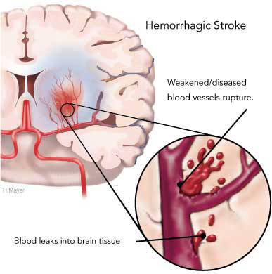

<p style = "font-size:10.5px; ">
<a href = "http://www.heartandstroke.com/site/c.ikIQLcMWJtE/b.3484153/k.7675/Stroke__Hemorrhagic_stroke.htm" style ="word-wrap: break-word;" >http://www.heartandstroke.com/site/c.ikIQLcMWJtE/b.3484153/k.7675/Stroke__Hemorrhagic_stroke.htm</a>
</p>

</div>
   <div id="right_col">

- When a blood vessel ruptures into tissue
- ≈ 13% of strokes


  </div>

</div>


# Larger Hemorrhage Volume ⇒ Worse Outcome

```{r biblio, results='hide'}
bibliography() 
```

# Goal: <br> Automatic Hemorrhage Volume Estimation 

## X-ray Computed Tomography (CT) Scans
<div class="notes">
Images are acquired from an X-ray scanner.  
x-ray goes around object and detector the other side of the object determines how many x-rays are recovered 
- fancy transform
- Image!
</div>
<div style="width:48%;float:left;">
<sub><sup><sub><sup>Image from http://www.cyberphysics.co.uk/topics/medical/CTScanner.htm</sup></sub></sup></sub>
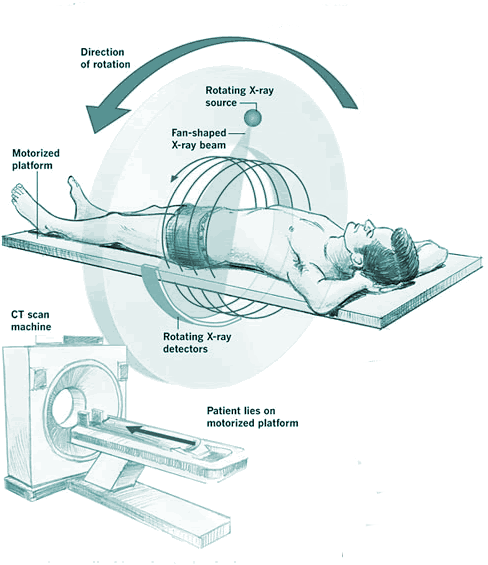
<br>
</div>
<div style="margin-left:48%;">
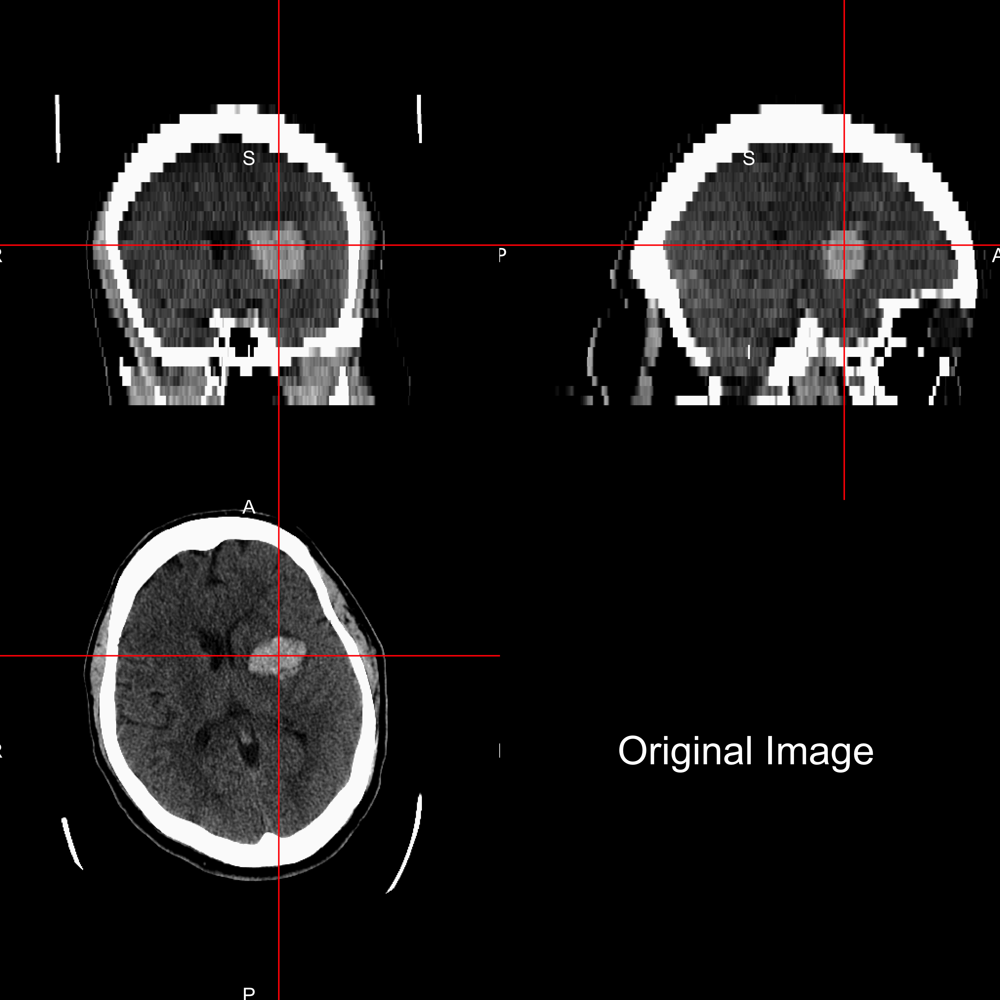
</div>


## Image Representation: voxels (3D pixels)
Typical CT has $512 \times 512 \times 30 ≈ 7.8$ million voxels

<div class="container"> 
<div id="left_col"> 
  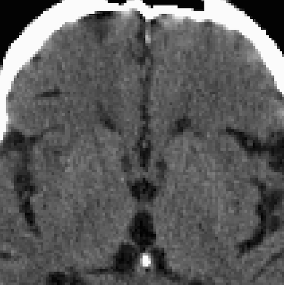
</div>
<div id="right_col"> 
  

<p style='font-size: 10pt;'>Muschelli, John, Elizabeth Sweeney, and Ciprian Crainiceanu. "brainR: Interactive 3 and 4D Images of High Resolution Neuroimage Data." R JOURNAL 6.1 (2014): 42-48.</p>
</div>
</div>


# How do we measure volume (currently)?

## Manual Segmentation

<div class="columns-2">

<br/>
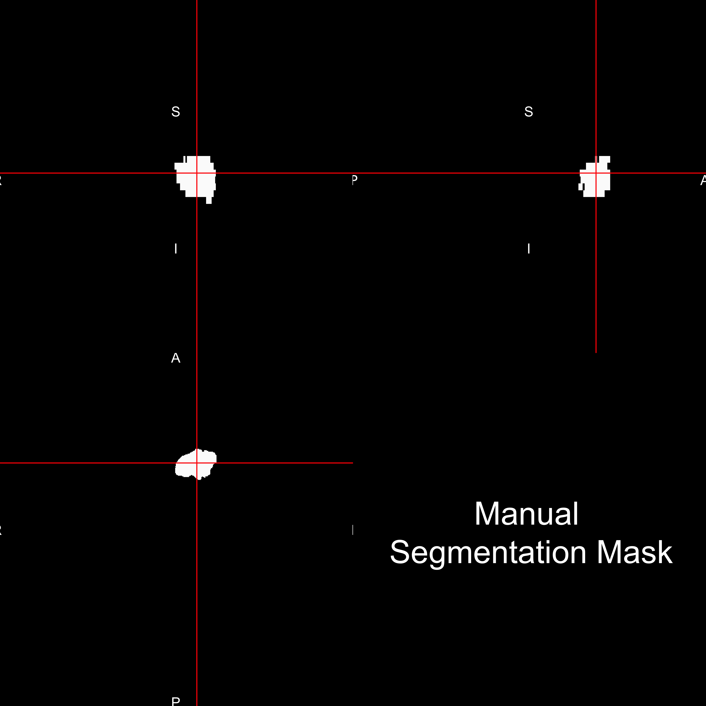
</div>


---- 
<div class="container"> 
<div id="left_col2"> 
  <h2>Workflow for the Analysis</h2>
  </div>    
  <div id="right_col2">
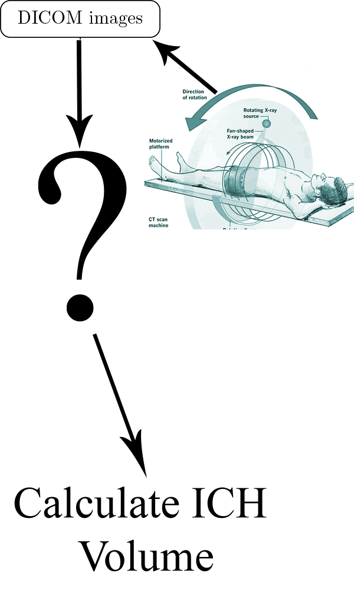
  </div>
</div>

---- 
<div class="container"> 
<div id="left_col2"> 
  <h2>Workflow for the Analysis</h2>
  </div>    
  <div id="right_col2">
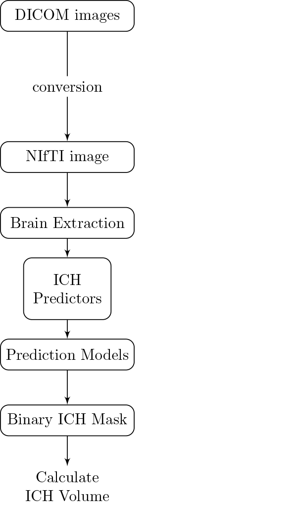
  </div>
</div>


## Problem: CT Scans Capture **Everything** 
Also has negative values

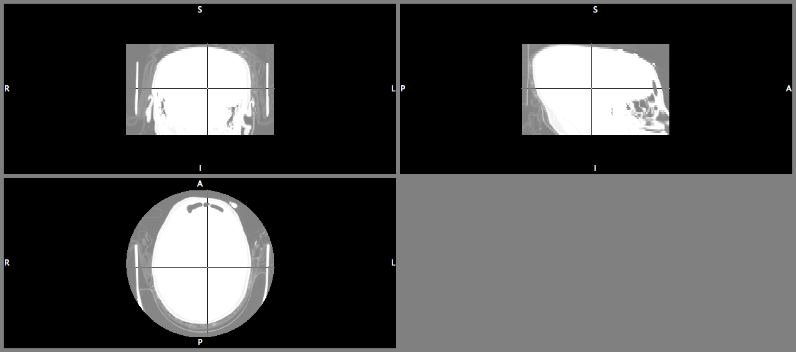


## Brain Segmentation of CT Scans (uses BET)

* Muschelli, John, et al. "Validated automatic brain extraction of head CT images." NeuroImage 114 (2015): 379-385. http://bit.ly/CTBET_RCODE 

<div class="columns-2">

<br/>
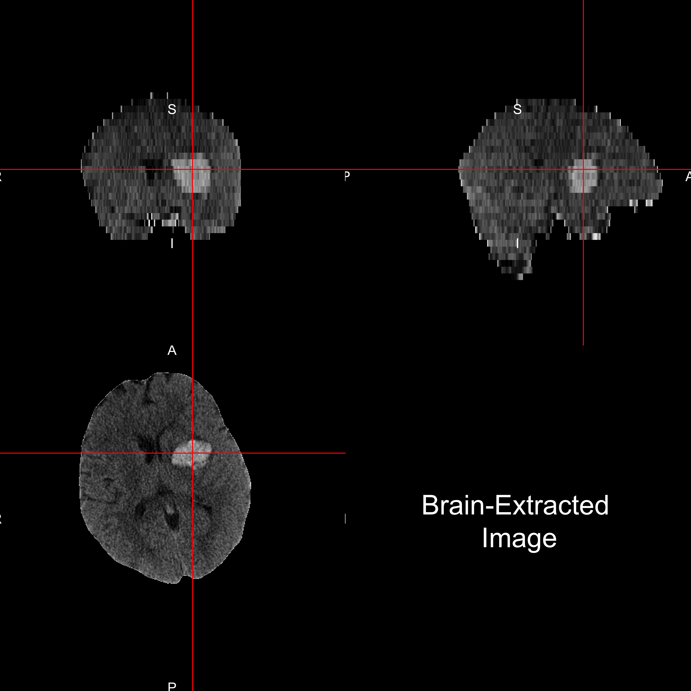
</div>

---- 
<div class="container"> 
<div id="left_col2"> 
  <h2>Workflow for the Analysis</h2>
  </div>    
  <div id="right_col2">
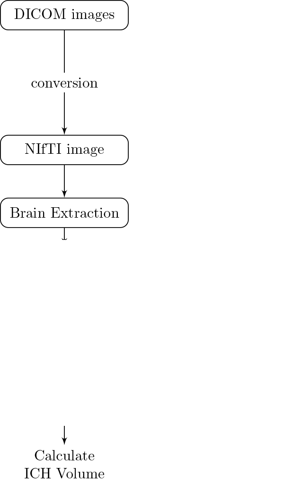
  </div>
</div>


# Hemorrhage Segmentation 


## Subject Data used: 111 scans (1 Per Patient)
<div id="wrap">
<div id="left_col">

```{r demog_table, results='asis', cache=FALSE}
tb1 = cbind(rownames(tb1), tb1)
rownames(tb1) = NULL
tb1[,1] = gsub("   ", "&nbsp;&nbsp;&nbsp;", tb1[,1])
ind = grepl("Clot Location", tb1[,1])
tb1[ind,1] = gsub("RC", "", tb1[ind,1])
tb1[ind,1] = gsub("^Clot", "Reader-Based Clot", tb1[ind,1])
pander(tb1, justify = c("lr"))
```

</div>
<div id="right_col"  style='font-size: 24pt;'>


- Adults (inclusion criteria 18-80 years old)
- Mostly males
- Different sites, scanners, and locations in the brain

</div>

</div>

---- 
<div class="container"> 
<div id="left_col2"> 
  <h2>Workflow for the Analysis</h2>
  </div>    
  <div id="right_col2">
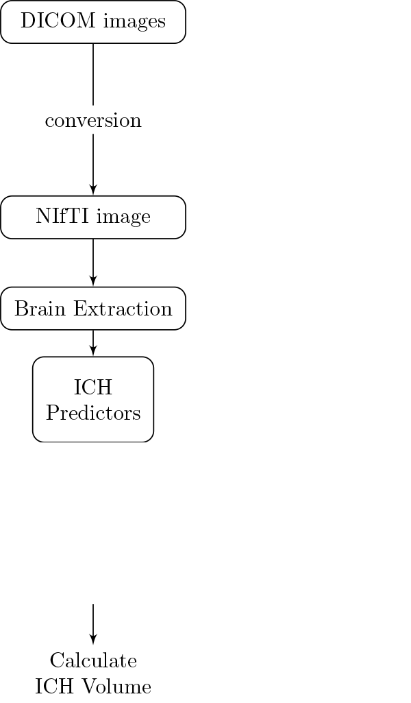
  </div>
</div>

----
<div class="container"> 
<div id="left_col2"> 
  <h2> Predictors of ICH </h2>
 
  - Local "neighborhood" moments (mean, sd, skew, kurtosis)

Local Mean: $\bar{x}(v) = \frac{1}{27} \sum\limits_{k}^{27} x_k(v)$   

  - Threshold intensity
  - Gaussian Smoother (**big** neighborhood)

    
  
  
  </div>    
  <div id="right_col2"> 
  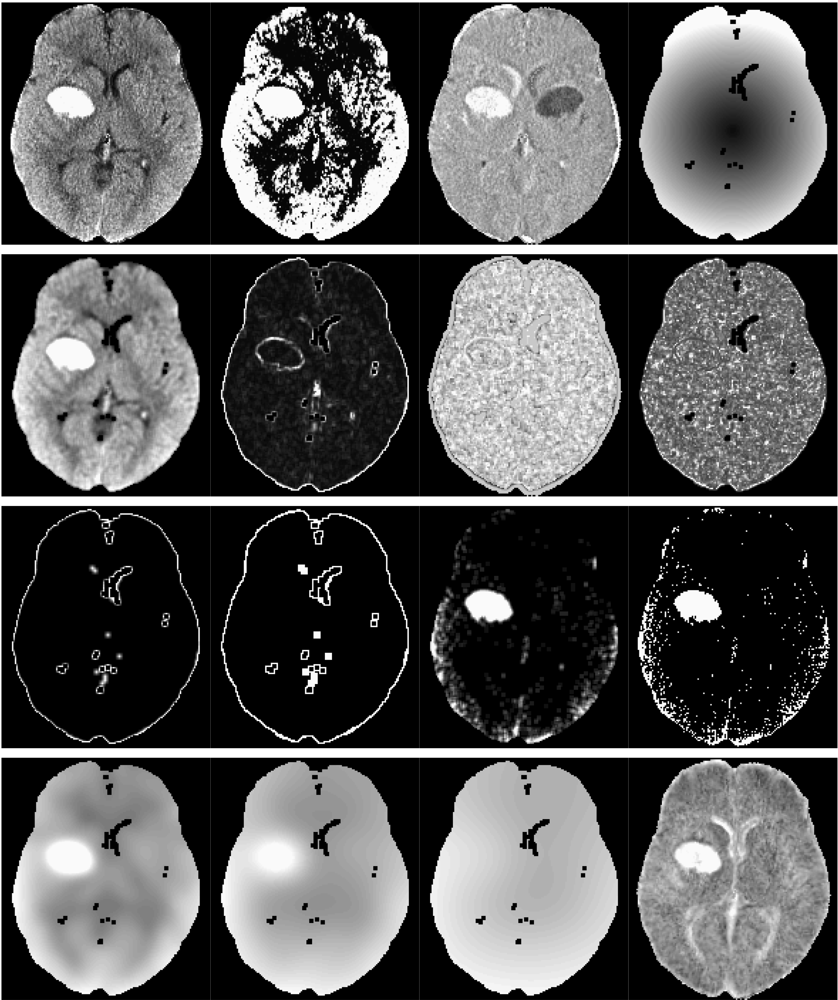  
  </div>
</div>


----

<div class="container"> 
<div id="left_col2"> 
  <h2>Data Structure for One Patient </h2> 
  
  - Each subject has matrix $X_{i}$
  - $V_{i}$ - voxels per person 
  - $P$ - number of predictors
  - $y_i$ - manual segmentation
  
 </div>    
  <div id="right_col2">   
  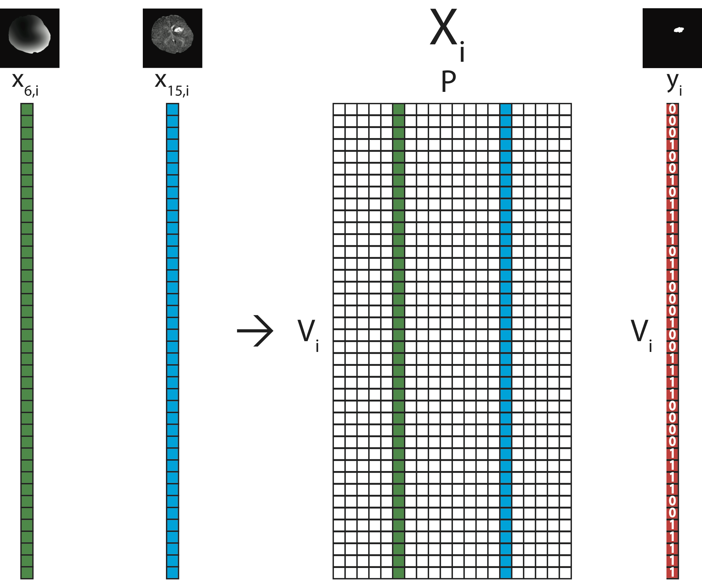  
  </div>
</div>  
  

----

<div class="container"> 
<div id="left_col2"> 
  <h2>Aggregate Data</h2>
  Training Data Structure
  
  * Stack together 10 randomly selected patients
  * Train model/classifier on this design matrix

  </div>    
  <div id="right_col2">
    
  </div> 
</div>


## Fit Models / Classifier

Again, $y_{i}(v)$ is the presence / absence of ICH for voxel $v$ from person $i$.  

General model form: 
$$
 P\{y_{i}(v) = 1\}  \propto f\{X_{i}(v)\}
$$

All models fit in R. 


## Models Fit on the Training Data

- Logistic Regression: \(f(X_{i}(v)) = \text{expit} \left\{ \beta_0 + \sum_{k= 1}^{p} x_{i, k}(v)\beta_{k}\right\}  \) (`glm` function)
- Generalized Additive Model `r citep("hastie_generalized_1990")` 
    - fit using penalized thin plate splines (`mgcv` package)
- LASSO `r citep(c("tibshirani_regression_1996", "friedman_regularization_2010"))` (`glmnet` package): 
$$ \mathcal{L}\left[\left.Y_{i}(v) \right|\, f\{X_i(v)\}\right] \propto \beta_0 + \sum_{k= 1}^{p} x_{i, k}(v) \beta_{k} + \lambda \sum_{k= 1}^{p} \left|\beta_{k}\right|
$$
- Random Forests `r citep(c("randomForest", "breiman2001random"))` (`randomForest` package)
<div class="centerer">
\(f(X_{i}(v)) \propto\) 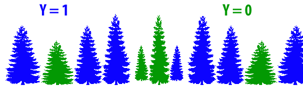
</div>

# All results are on the 101 scans/patients <br/> not in the training data

----
<div class="container"> 
<div id="left_col"> 

- Get prediction for each voxel: $\hat{p}_{i}(v) = \hat{P}(y_i(v) = 1)$
- Threshold to get a binary value: $\hat{y}_{i} = \hat{p}_{i}(v) > 0.5$


$$
\text{Estimated Volume}_{i} = \text{cc per voxel} \times \sum_{v}^{V_i} \hat{y}_{i}(v)
$$

$$
\text{Volume}_{i}  = \text{cc per voxel} \times \sum_{v}^{V_i} y_{i}(v)
$$

- cc = cubic centimeters
- one milliliter (mL) = 1 cc

  </div>    
  <div id="right_col">
  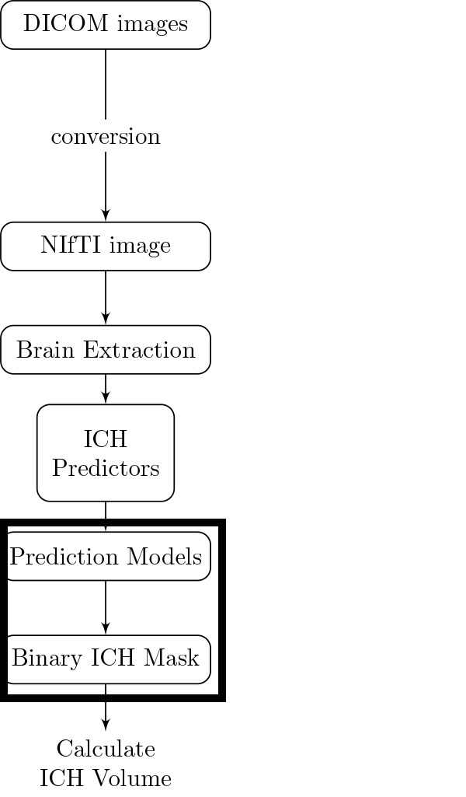  
  </div>
</div>

## Predicted Volume Estimates True Volume Well 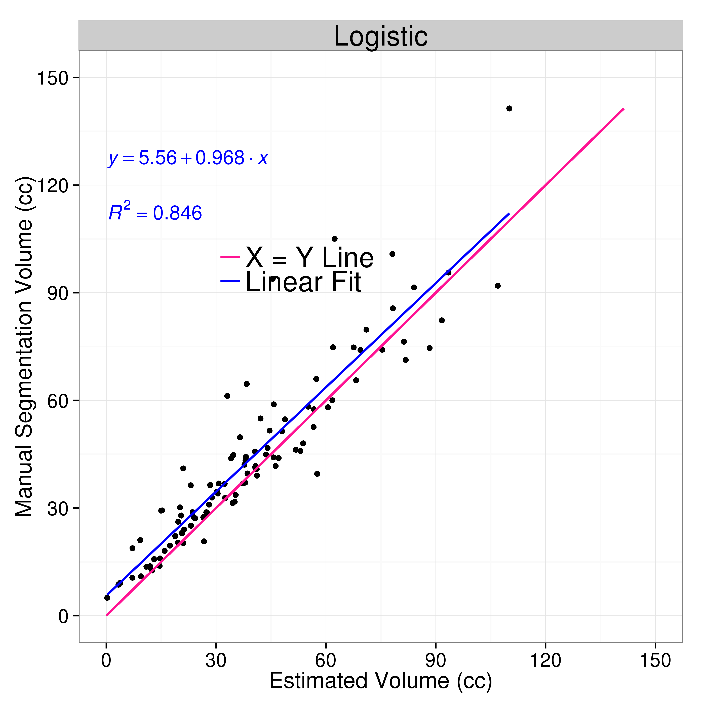

## All models predicted volume pretty well 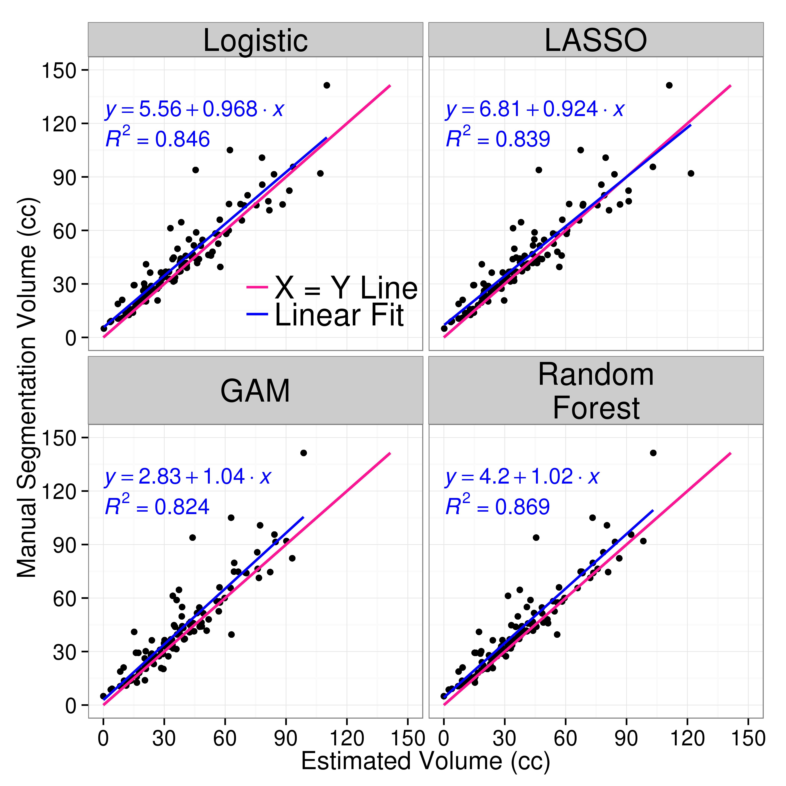


## Two Segmentations with the Same Volume
<div class="columns-2">
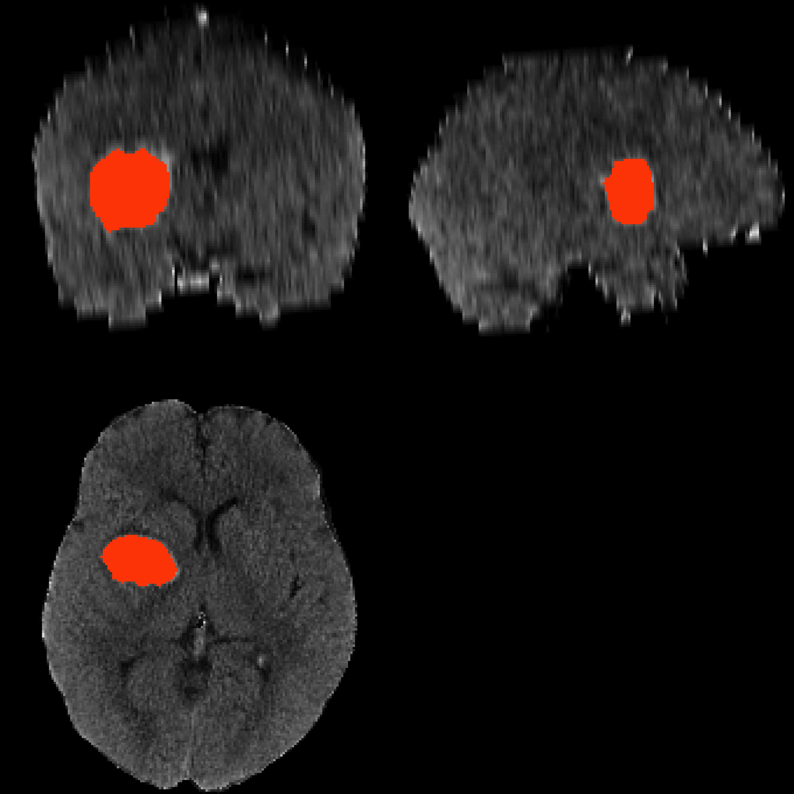
<br/>
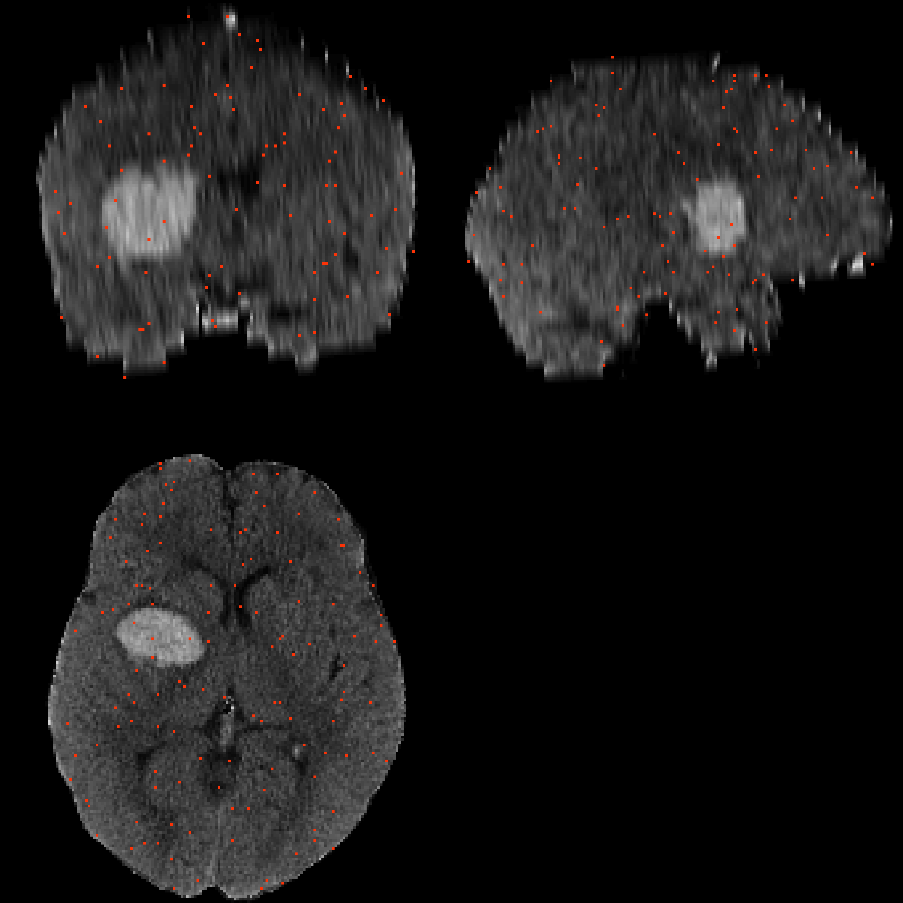
</div>

## Dice Similarity Index/Overlap by Scanner 
<div class="columns-2">
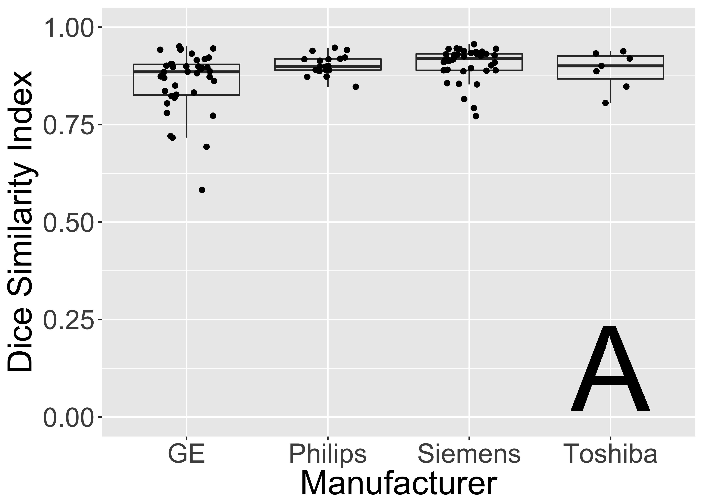
<br/>
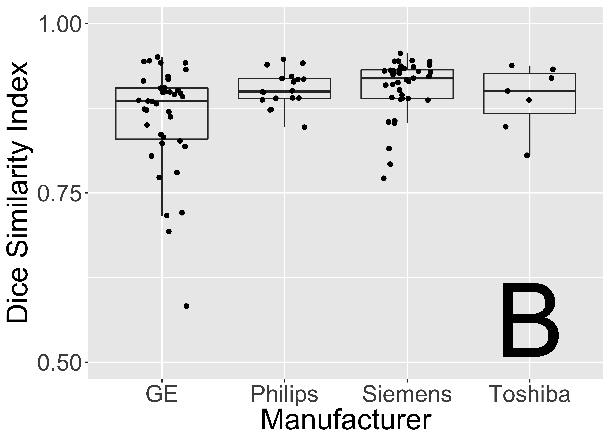
</div>

## Patient with Median Overlap/Dice

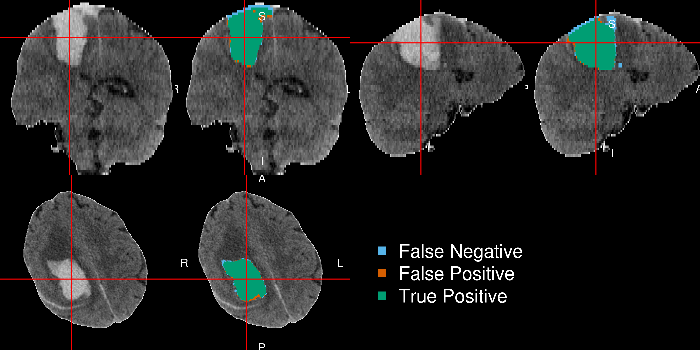 

## Why'd that one fail? 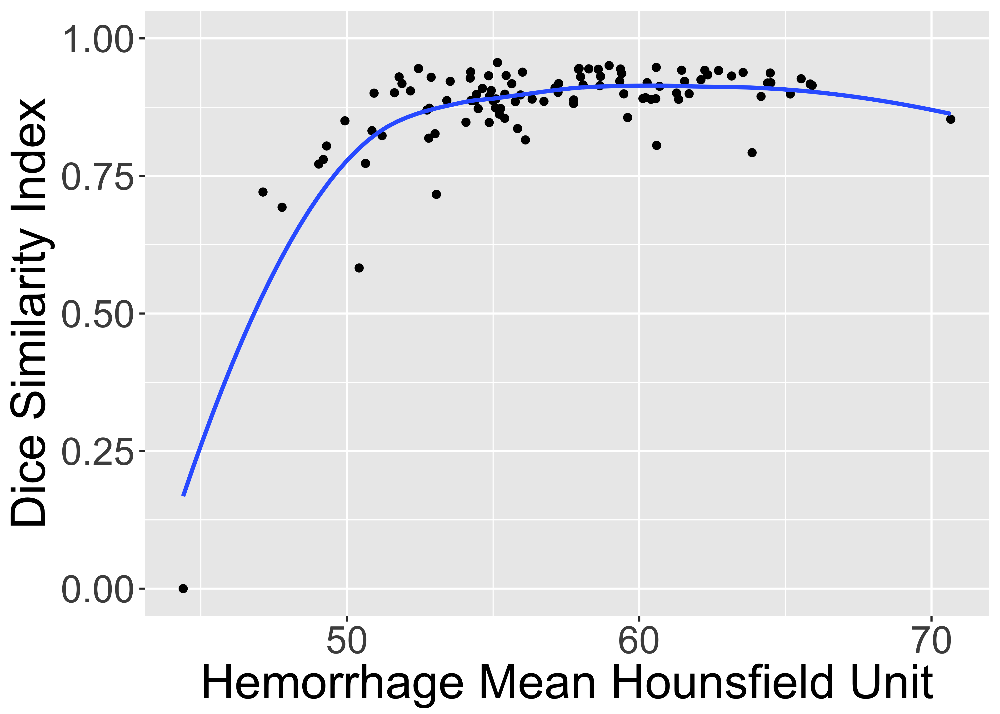


## Conclusions of Stroke Analyses

<div style="font-size: 24pt">

- We can segment ICH volume from CT scans 
- The predictors seemed to be the "secret sauce"
    - not the algorithm
- Chose the Random Forest
    - PItcHPERFeCT: Primary Intracranial Hemorrhage Probability Estimation using Random Forests on CT

- R Package: [https://github.com/muschellij2/ichseg](https://github.com/muschellij2/ichseg)    
- Shiny Application [http://johnmuschelli.com/ich_segment.html](http://johnmuschelli.com/ich_segment.html)

</div>


----
<div class="container"> 
<div id="left_col2"> 
  <h2>Workflow for the Analysis</h2>
<div style='font-size: 32pt;'>
  
Multiple pieces of software used

  - all different syntax
</div>
  </div>    
  <div id="right_col2">
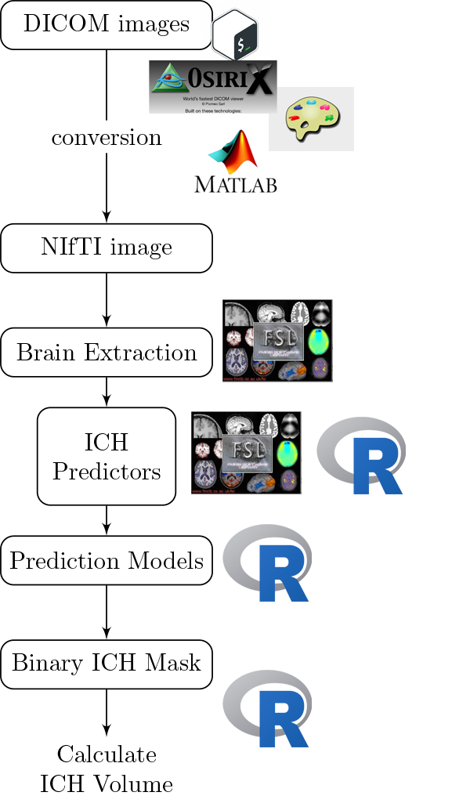
  </div>
</div>


```{r, cache = TRUE}
if (!require(cranlogs)) {
  devtools::install_github("metacran/cranlogs")
}
first_date = "2014-01-10"
today = Sys.Date()
long_today = format(Sys.time(), "%B %d, %Y")
packs = c("fslr", "brainR", "matlabr", "spm12r", "WhiteStripe", "oasis", "freesurfer", "papayar")
last_week = cran_downloads( when = "last-week",
                            packages = packs)
last_week = plyr::ddply(last_week, .(package), summarise, 
                  Last_Week = sum(count))
dl = cran_downloads( from = first_date, to = today,
                     packages = packs)
dl = ddply(dl, .(package), summarise, All_Time = sum(count))
dl = merge(dl, last_week)
dl = plyr::arrange(dl, desc(Last_Week))
colnames(dl) = c("Package", "All Time", "Last Week")
made_packs = c("fslr", "spm12r", "freesurfer")
made_packs = dl$Package[ dl$Package %in% made_packs] 
dl$Package[ dl$Package %in% made_packs] = paste0("<strong>", made_packs, "</strong>")
```


# 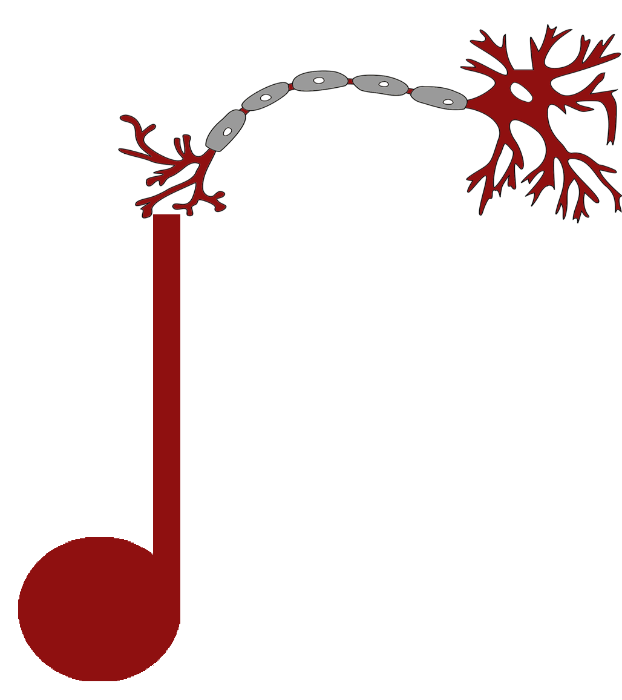 Neuroconductor: <br> A Framework for Reproducible Neuroimaging Analysis <br> in R


----
<div class="container"> 
<div id="left_col2"> 
  <h2>Neuroconductor Goal: </h2>
<div style='font-size: 24pt;'>
  
Lower the bar to entry 

- all R code
    - pipeline tool
    - native R code

Complete pipeline
  
  - pipeline sensitivity analyses
</div>
  </div>    
  <div id="right_col2">
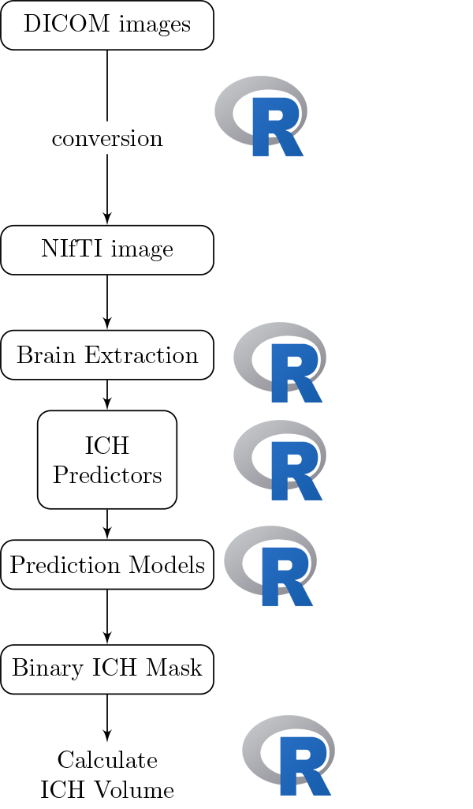
  </div>
</div>


## It's typical to have lots of software choices

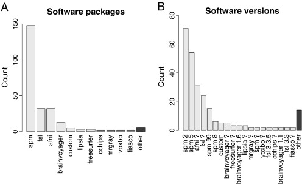

<!--  -->

From Carp, Joshua. "The secret lives of experiments: methods reporting in the fMRI literature." Neuroimage 63.1 (2012): 289-300.


## Current Progress (my R packages)

Number of downloads as of `r format(today, format="%B %d, %Y")` (`cranlogs` package):

<div class="container"> 
   <div class="left-half">

```{r, results = "asis", eval = TRUE}
DT::datatable(dl, filter = "none", selection = "none", rownames = FALSE,
          options = list(dom = 't', autoWidth = TRUE,
                         columnDefs = list(list(
                           className = 'dt-center',
                           targets = 0))),
          escape = FALSE
)
```
</div>
   <div class="right-half">
  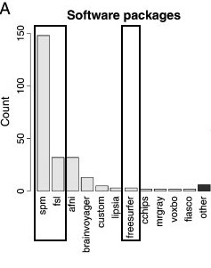  
  </div> 
</div>


----
<div class="container"> 
<div id="left_col2"> 
  <h2>Neuroconductor Goal: </h2>
<div style='font-size: 28pt;'>
  
Centralize the packages
  
- [Medical Imaging Task View](https://cran.r-project.org/web/views/MedicalImaging.html) 
    - no tutorials
- [Neuroconductor Repository](https://github.com/neuroconductor/)
  </p>
</div>   
</div>    
  <div id="right_col2">
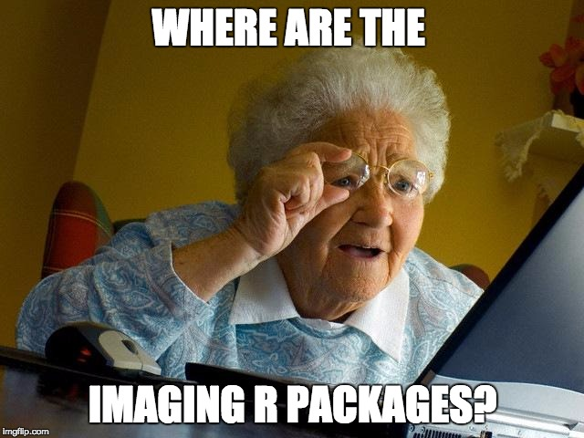
  <p style='font-size: 12pt;'> From [https://imgflip.com/memegenerator/Grandma-Finds-The-Internet](https://imgflip.com/memegenerator/Grandma-Finds-The-Internet).
  </p>
  </div>
</div>

----
<div class="container"> 
<div id="left_col2"> 
<h2>Neuroconductor Goal: </h2>

<div style='font-size: 28pt;'>

Detailed **tutorials** on how to actually perform an analysis  

</br>

- [http://johnmuschelli.com/neuroc/](http://johnmuschelli.com/neuroc/)  

</div> 
</div>    
<div id="right_col2">

<p style='font-size: 10pt;'> From [http://i.imgur.com/0Y1xISa.gifv](http://i.imgur.com/0Y1xISa.gifv).
</p>
</div>
</div>


<!-- ---- -->
<!-- <div class="container">  -->
<!--   <div class="left-half">  -->
<!--     <h2>Neuroconductor Goal: </h2> -->

<!--     <div style='font-size: 28pt;'> -->

<!--     Detailed **tutorials** on how to actually perform an analysis -->


<!--     </div> -->
<!--   </div>     -->
<!--   <div class="right-half">  -->
<!--    -->
<!--     <p style='font-size: 10pt;'> From [http://i.imgur.com/0Y1xISa.gifv](http://i.imgur.com/0Y1xISa.gifv). -->
<!--     </p> -->

<!--   </div> -->
<!--   <div style='font-size: 28pt;'> -->
<!--   [http://johnmuschelli.com/neuroc/](http://johnmuschelli.com/neuroc/)   -->
<!--   </div> -->
<!-- </div> -->


----
<div class="container"> 
<div id="left_col2"> 
  <h2>Neuroconductor Goal: </h2>
  
<div style='font-size: 28pt;'>
  
Provide package checks / rules / **stability** 
  
- check against other imaging software (e.g. FSL)

</div> 
  </p>
</div>    
  <div id="right_col2">
  
   

     

     
  
<!-- 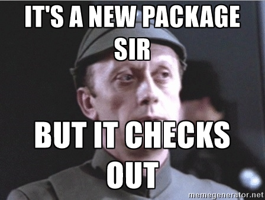 -->
<!--   <p style='font-size: 12pt;'> From [https://memegenerator.net/instance/51553268](https://memegenerator.net/instance/51553268). -->
<!--   </p> -->
  </div>
</div>


## Benefits of Neuroconductor: 

<div style='font-size: 32pt;'>
  
Allow neuroimaging to use all R has to offer:
  
- Statistics and Machine Learning
- Versioning and testing
- Reproducibile reports and analyses
- Shiny (web applications)
  
</div>


##  Neuroconductor Downsides

<div style='font-size: 28pt;'>

1.  More control over the workflow = more work
2.  Users need external software (versions/installation)
3.  No control over external software
    - if maintainer changes something, not much recourse
4.  Need the content (buy-in from the community)

</div>

## Training we are providing

<div class="container"> 
   <div class="left-half" style="font-size: 28pt;">
   Coursera Course: Introduction to Neurohacking In R 
  </div>
  <div class="right-half" style="font-size: 28pt;">
  
  </div>
[https://www.coursera.org/learn/neurohacking/](https://www.coursera.org/learn/neurohacking/)

<div style="font-size: 28pt;">
   Short Course: Neuroimaging analysis within R (ISBI, Melbourne, April 2017)

   Statistics in Imaging (Pittsburgh, May 2017)
</div>
</div>


## Thanks

<div class="container"> 
   <div class="left-half" style="font-size: 28pt;">
   Dan Hanley 


   Ciprian Crainiceanu
    
   

   Brian Caffo
   
   


</div>
   <div class="right-half">
   
   Jean-Philippe Fortin       

   Adi Gherman
   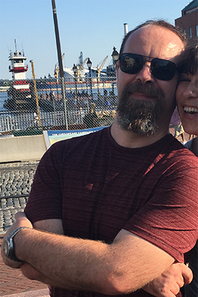 
   
   
   Elizabeth Sweeney    

      
</div>
</div>

# Questions


## Assessing Performance 
For each manual and automated segmentation, we can calculate the following 2-by-2 table, where the cells represent number of voxels and a corresponding Venn diagram:

<div style="width:45%;float: left;">
```{r, results='hide'}
mat = matrix(c("TN", "FN", "FP", "TP"), ncol=2, byrow=2)
colnames(mat) = rownames(mat) = c(0, 1)
names(dimnames(mat)) = c("PitCH", "Manual")
pander(mat, style="grid")
```

<table class = 'rmdtable' style='font-size: 26px;'>
<tr class = "header"><td></td><td></td><td colspan="2">Manual</td></tr>
<tr class = "header"><td></td><td></td><td>0</td><td>1</td></tr>
<tr><td rowspan="2"> PitCH</td><td>0</td><td style='font-size: 40px;'>TN</td><td style="color:blue">FN</td></tr>
<tr><td>1</td><td style="color:red">FP</td><td style="color:purple">TP</td></tr>
</table>
</div>

<div style="margin-left:48%;">

</div>

## Dice Similarity

<div style="width:48%;float:left;">
We calculate the Dice Similarity Index (DSI):
$$
\definecolor{red}{RGB}{255,0,0}
\definecolor{blue}{RGB}{0,0,255}
\definecolor{purple}{RGB}{128,0,128}
\definecolor{blac,}{RGB}{0,0,0}
\frac{ \color{purple} 2 \times \#  \text{TP} }{ \color{purple}  2 \times \#\text{TP} \color{black} + \color{red} \text{FN} \color{black} + \color{blue} \text{FP}} 
$$

- 0 indicates no overlap
- 1 means perfect agreement  
</div>

<div style="margin-left:48%;">

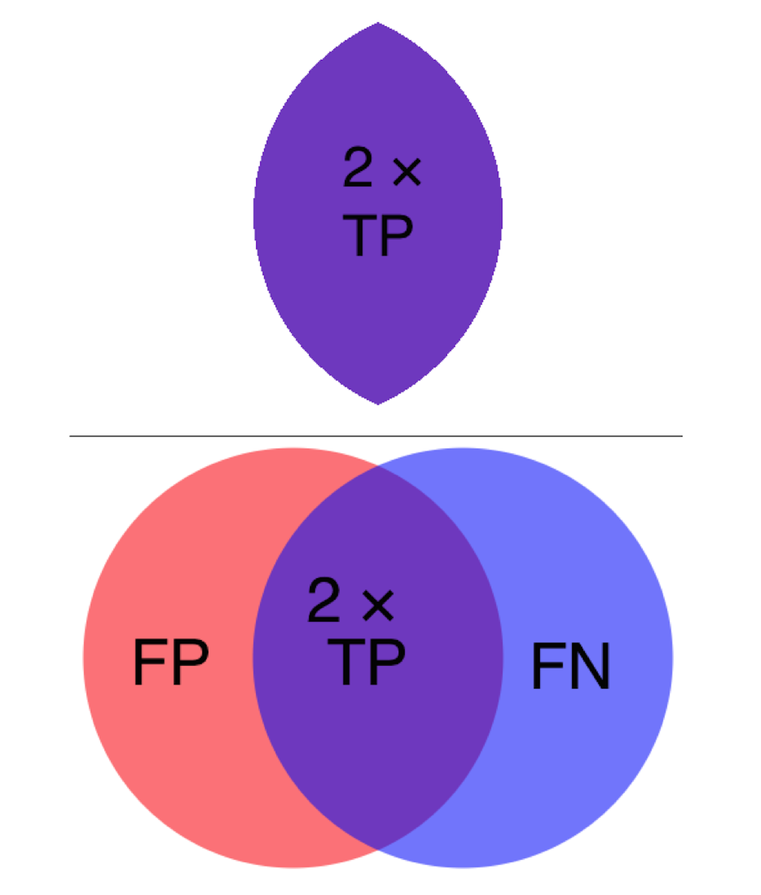

</div>


## 

## 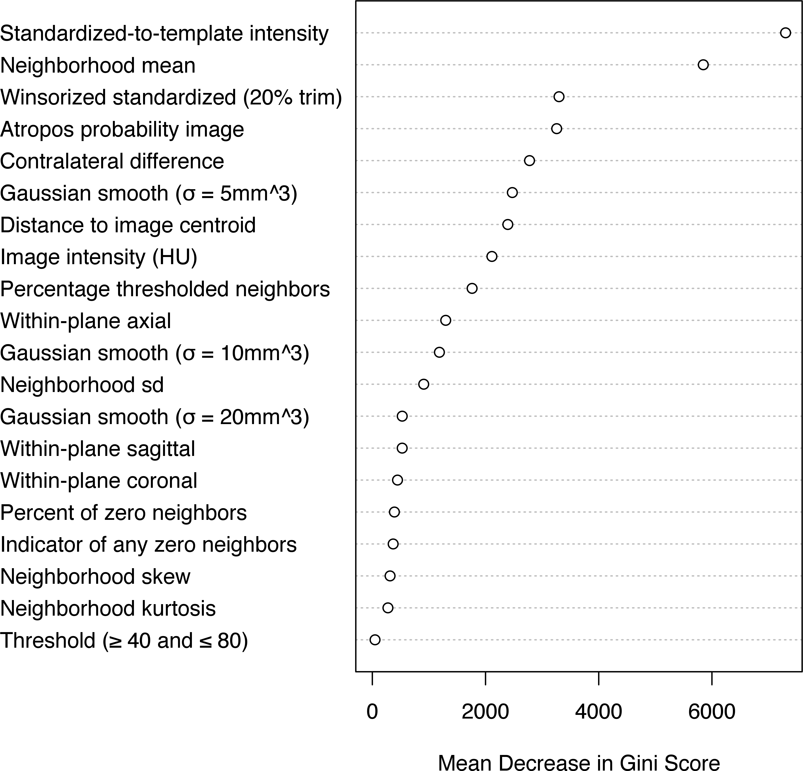

## 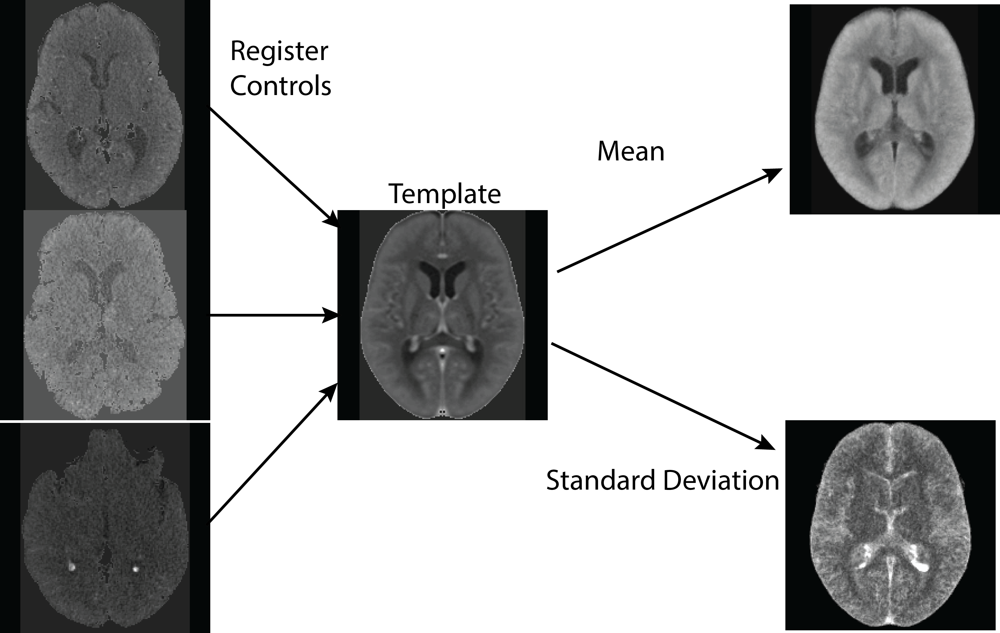

## 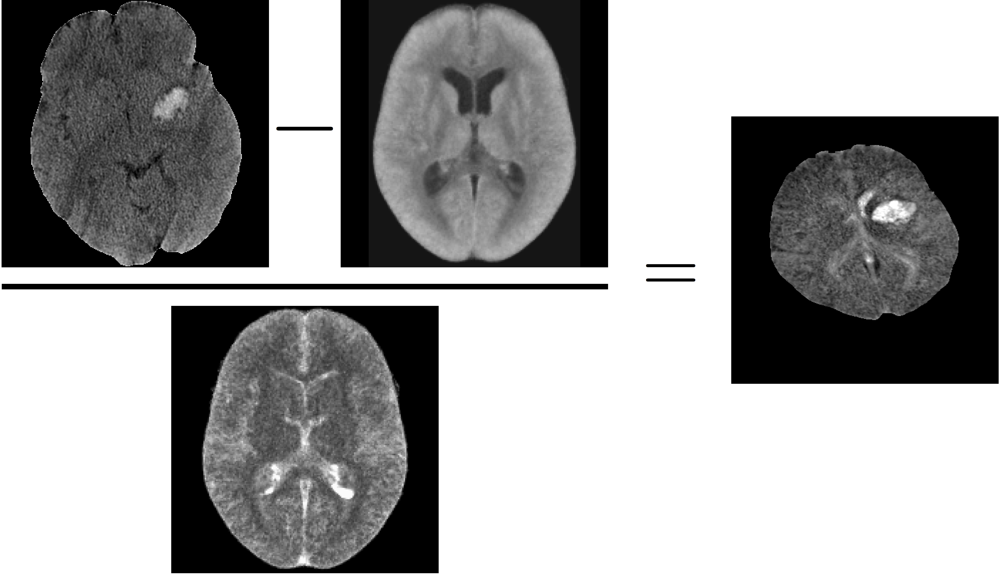


## Under Development R Packages

1.  nitrc - download data from the **NITRC repository**
2.  MNITemplate$^*$ - data of a population-level "template" image
3.  EveTemplate$^*$ - data of a different template image
4.  kirby21 - data package with 2 subjects, 2 visits with multimodal imaging
5.  rcamino - interface to analyze DTI data
6.  msseg - MS lesion segmentation 
7.  extrantsr - pipelines for structural imaging analysis

Not started yet

8.  neurohcp - interface with Human Connectome Project
9.  afnir - R port of AFNI software (No. 2 on the chart)

$^*$ - working with Jean-Philippe Fortin on these


---

<div class="container"> 
<div id="left_col2"> 

```{r packages}
x = readLines("Penn.Rmd")
x = trimws(x)
x = grep("^library\\(", x, value = TRUE)
libs = gsub("^library\\((.*)\\)", "\\1", x)
libs = c("rmarkdown", "knitr", libs)
libs = unique(libs)
libs = sort(libs)
last_lib = libs[length(libs)]
libs = paste0(libs[1:(length(libs) - 1)], collapse = ", ")
libs = paste0(libs, ", and ", last_lib)
```
The `r libs` packages were used to create this presentation in RStudio.
</div>
<div id="right_col2" style='font-size: 6pt;'> 

```{r, results='markup'}
devtools::session_info()
```
</div>
</div>


## Ischemic Stroke

<div class="container">
<div id="left_col">
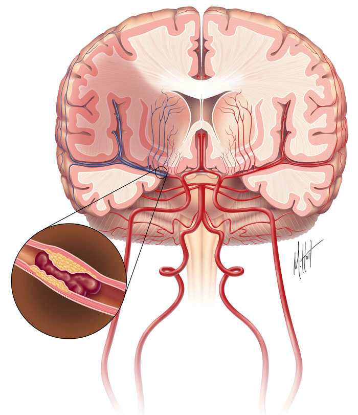
</div>
<div id="right_col">

- Ischemic stroke - clot blocks oxygen/nutrients
- Tissue dies
- ≈87% of strokes

<p style = "font-size:10.5px;">
Image from <a href = "http://www.strokecenter.org/patients/about-stroke/ischemic-stroke/
" style ="word-wrap: break-word;" >http://www.strokecenter.org/patients/about-stroke/ischemic-stroke/
</a>
</p>
</div>
</div>

----
<div class="container"> 
<div class="left-half"> 
  <h2>Neuroconductor Goal: </h2>
  
  <p>
  R **Data** packages for testing
  
  - getting data is a common problem
  - developers can test packages
  - Kirby21 Data:
    - https://github.com/muschellij2/kirby21.t1
    - https://github.com/muschellij2/kirby21.t2
    - https://github.com/muschellij2/kirby21.flair
    - https://github.com/muschellij2/kirby21.fmri
    - https://github.com/muschellij2/kirby21.dti
  
  </p>
</div>    
  <div class="right-half"> 
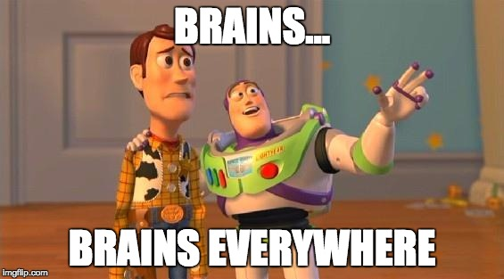
  <p style='font-size: 12pt;'> From [https://memegenerator.net/Everywhere-Toy-Story](https://memegenerator.net/Everywhere-Toy-Story).
  </p>

  </div>
</div>


## Not Ischemic Stroke

<div class="container">
<div id="left_col">
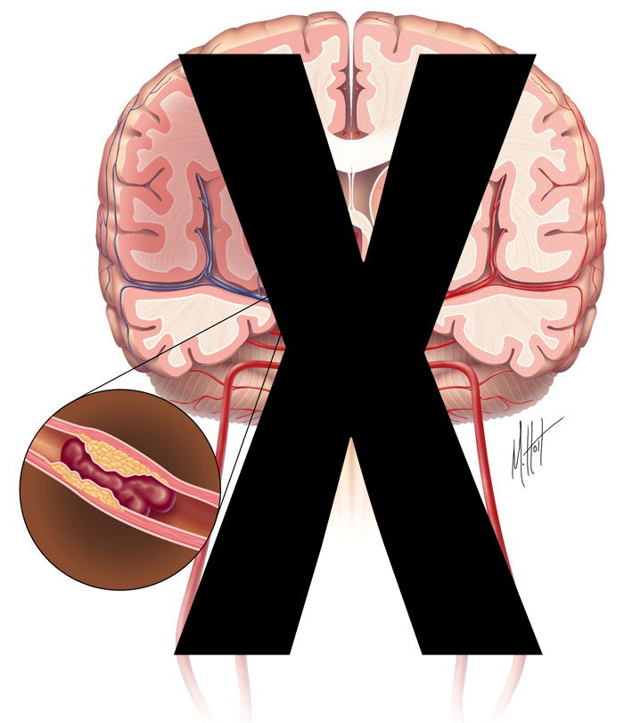
</div>
<div id="right_col">

- Ischemic stroke - clot blocks oxygen/nutrients
- Tissue dies
- ≈87% of strokes

<p style = "font-size:10.5px;">
Image from <a href = "http://www.strokecenter.org/patients/about-stroke/ischemic-stroke/
" style ="word-wrap: break-word;" >http://www.strokecenter.org/patients/about-stroke/ischemic-stroke/
</a>
</p>
</div>
</div>
