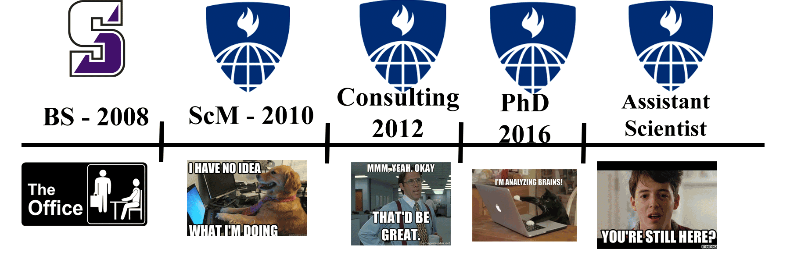
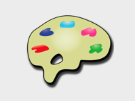
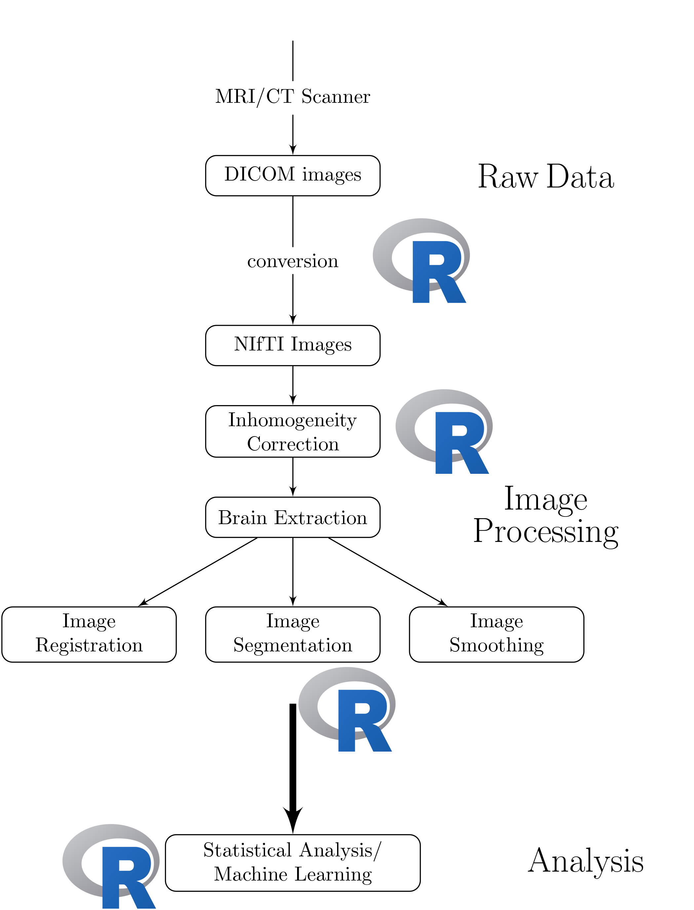

<style type="text/css">
article {
  font-size: 30pt;
}
</style>


```{r setup, include=FALSE}
knitr::opts_chunk$set(echo = FALSE, prompt = FALSE, message = FALSE, warning = FALSE, comment = "", results = 'hide')
library(pander)
library(rvest)
library(httr)
```


## What language do you teach your (stats) students? 

- R 
- Matlab
- Python
- SAS / Stata

## What language do you/your imaging students work in?


- R 
- Matlab
- Python

(note SAS/Stata do not exist in this domain)

## Are these the same?

- Yes
- No


## 
<div>
&emsp;&emsp;&emsp;&emsp;&emsp;&emsp;&emsp;&emsp;&emsp;&emsp;&emsp;fMRI&emsp;&emsp;&emsp;MRI/CT<br>
&emsp;&emsp;&emsp;&emsp;&emsp;&emsp;&emsp;&emsp;&emsp;&emsp;&emsp;analysis&emsp;&ensp;analysis
</div>


## Lessons Learned using Matlab/SPM

- Matlab and R are very similar (sometimes annoyingly so)
- R had more intuitive (to me) spreadsheet structures
- SPM has great tools, but not all are intuitive
    - Batch tools are great
    - Checking registration can be a pain


# <br> An R Platform for <br> Medical Imaging Analysis


## What **really** is Neuroconductor?

1.  A community of developers and users of R packages for imaging
2.  A website [https://neuroconductor.org/](https://neuroconductor.org/).
    - with tutorials and help
3.  A team helping developers and users (John, Adi Gherman, Ciprian Crainiceanu, Brian Caffo)
4.  A centralized repository of maintained packages

## Inspiration<br>  

- centralized bioinformatics/genomics packages
- large community/number of packages (> 1300)
- published tutorials and workflows 
- additional requirements to CRAN (e.g. packages need vignettes)

## Inspiration 

- integrates multiple neuroimaging software
- standardizes the syntax
- provides workflows
- allows the user to take advantage of all of Python
    - pandas, scikit-learn, Jupyter notebooks

```{r, cache = TRUE, echo = FALSE, results='hide'}
  url = httr:::GET("https://neuroconductor.org/list-packages/all")
  cr = content(url)
  tab = html_table(cr)[[1]]
  nr = nrow(tab)
```

## SPM GUI + courses!<br> 

## What did R have?<br> <br>Where do I start???


## Goal: Centralize the packages (currently `r nr`)
<div class="container"> 
  <div class="left-half"> 
  

  
  <p style='font-size: 12pt;'>
  [https://neuroconductor.org/list-packages/all](https://neuroconductor.org/list-packages/all)</p>
  
  
  
  </div>    
  <div class="right-half">
  <p style='font-size: 12pt;'> [https://imgflip.com/memegenerator/Grandma-Finds-The-Internet](https://imgflip.com/memegenerator/Grandma-Finds-The-Internet)
  </p>  


  </div>
</div>


## Why not CRAN

- Data packages


## Why not CRAN

- Timings/Checks - need more lenient in some

## Why not CRAN

- ANTsR


----
<div class="container"> 
<div id="left_col2"> 
  <h2>Workflow for an Analysis</h2>
<div style='font-size: 32pt;'>
  
Multiple pieces of software used

  - all different syntax
</div>
  </div>    
  <div id="right_col2">

  </div>
</div>

----
<div class="container"> 
<div id="left_col2"> 
  <h2>Workflow for an Analysis</h2>
<div style='font-size: 32pt;'>

- bash  
- FSL  
- ANTs  
- MRIcroGL  
- OsiriX  
- SPM 12  

</div>
  </div>    
  <div id="right_col2">

  </div>
</div>


## It's typical to have lots of software choices


<!--  -->

From Carp, Joshua. "The secret lives of experiments: methods reporting in the fMRI literature." Neuroimage 63.1 (2012): 289-300.

----
<div class="container"> 
<div id="left_col2"> 
  <h2>Goal: </h2>
<div style='font-size: 24pt;'>
  
Lower the bar to entry 

- all R code
    - pipeline tool
    - "native" R code

Complete pipeline
  
  - preprocessing and analysis
</div>
  </div>    
  <div id="right_col2">

  </div>
</div>


----
<div class="container"> 
<div id="left_col2"> 
<h2>Neuroconductor Goal: </h2>

<div style='font-size: 28pt;'>

Detailed **tutorials** on how to actually perform an analysis  

</br>

- [http://johnmuschelli.com/neuroc/](http://johnmuschelli.com/neuroc/)  

</div> 
</div>    
<div id="right_col2">

<p style='font-size: 10pt;'> From [http://i.imgur.com/0Y1xISa.gifv](http://i.imgur.com/0Y1xISa.gifv).
</p>
</div>
</div>


## Neuroconductor Capabilities

```{r, results='asis'}
mat = c("DICOM Images", " oro.dicom, dcm2niir, divest, ANTsR",
"NIfTI Images", " oro.nifti, RNifti, ANTsR",
"Image Registration", "spm12r, fslr, ANTsR, freesurfer",
"Inhomogeneity Correction", " spm12r, fslr, ANTsR",
"Brain Extraction", " spm12r, fslr, ANTsR, extrantsr",
"Structure Segmentation", " spm12r, fslr, ANTsR, extrantsr, freesurfer",
"Intensity Normalization", " WhiteStripe, neurobase, ANTsR",
"3D Smoothing", " ANTsR, spm12r, fslr",
"Temporal Filtering", "spm12r, fslr, ANTsR",
"Slice-timing correction", " spm12r, fslr",
"DTI models", " rcamino, oro.dti, fslr")
mat = matrix(mat, ncol = 2, byrow = TRUE)
df = data.frame(mat, stringsAsFactors = FALSE)
colnames(df) = c("Capabilities", "Packages")
df$Packages = trimws(df$Packages)
pander(df)
```

## Git and GitHub

- Git is version control system: stores changes of files 
 

- GitHub is an **online** server of repositories
- Distribute packages and install them via `devtools::install_github`

 

## Continuous Integration: Travis and Appveyor

- Builds and checks R packages on Windows (Appveyor) and Linux/OS X (Travis CI)
- Works well with GitHub

 &emsp;&emsp;&emsp;  

----
<div class="container"> 
<div id="left_col2"> 
  <h2>Neuroconductor Goal: </h2>
  
<div style='font-size: 28pt;'>
  
Provide package checks / rules / **stability** 
  
- check against other imaging software (e.g. FSL)

</div> 
  </p>
</div>    
  <div id="right_col2">
  
   
  </div>
</div>

## NEXT SLIDES

- Talk about ANTsR
- Talk about oro.nifti standardization
- Talk about voxel package - 
- RStan - bayesian and such
- Talk about kirby21, neurohcp, and ms.lesion packages
    - EveTemplate/MNITemplate - fully contained
- Discuss R package development and why it is good
- How do you get involved?
    - what is needed?
    - talk about fMRI analyses
- Additional imaging modalities
    - PET/DTI
    - CT
    - Other than the brain
    - MR Spectroscopy Analysis Tools


## Benefits of Neuroconductor: 

<div style='font-size: 32pt;'>
  
Allow neuroimaging to use all R has to offer:
  
- Statistics and Machine Learning
- Versioning and testing
- Reproducibile reports and analyses
- Shiny (web applications)
- Genomics/Imaging analysis in one platform
    - Bioconductor
  
</div>


##  Neuroconductor Downsides

<div style='font-size: 28pt;'>

1.  More control over the workflow = more work
2.  Users need external software (versions/installation)
3.  No control over external software
    - if maintainer changes something, not much recourse
4.  Need the content (buy-in from the community)

</div>

----
<div class="container"> 
<div id="left_col2"> 
  <h2>Potential Neuroconductor Downsides: </h2>
<div style='font-size: 24pt;'>

Enabling statisticians to do preprocessing also **enables** imagers to do advanced statistics.

- Why enlist us for only this part?

</div>
  </div>    
  <div id="right_col2">

  </div>
</div>


## Training we are providing

<div class="container"> 
   <div class="left-half" style="font-size: 28pt;">
   Coursera Course: Introduction to Neurohacking In R 
  </div>
  <div class="right-half" style="font-size: 28pt;">
  
  </div>
[https://www.coursera.org/learn/neurohacking/](https://www.coursera.org/learn/neurohacking/)

<div style="font-size: 28pt;">
   Short Course: Neuroimaging analysis within R (ISBI, Melbourne, April 2017)

   Statistics in Imaging
   
   ENAR 2018
</div>
</div>

# My Opinions 

# Without Doing/Knowing the Preprocessing, Analyses Cannot be Trusted

# Without Code/Software for Methods, They are just Theory


## Future work
  - F1000 R packages channel - get publication for workflow
  - Removing dupliate packages from CRAN - like Bioconductor
  - Docker image for Neuroconductor:    

# Questions


## Crap

- A little history
    - I did fMRI analysis for 2 years
      - matlab/SPM shop
      - not the biggest fan of MATLAB data.frame structures
      - also didn't read nii.gz - wtf?
    - CT work 
      - take the MRI tools for CT
      - wanted more command line tools
      - wanted to implement some things in R
  - AnalyzeFMRI, oro.nifti, fmri, 
      
- What is it (broad)
    - matlab figure
    - R only figure
    
- What is it really?
    - a website that ties together all the relevant packages
        - tutorials
    - an additional set of standards (vignettes) similar to bioconductor
    - a centralized repository of copied and maintained packages
    - a community of users
    - a support for developers (me + adi)
- Why not CRAN
    - task view not good enough
    - data packages are not going in
    - ANTsR
    - 
- Actual backend
    - what happens when you upload a package
    - what is Git, what is GitHub
    - what is Travis / Appveyor

  
- Why should you care
    - gives you access to preprocessing
      - "Without Doing/Knowing the Preprocessing"
      - GIGO
      - Genomics does not accept - neither should we
        - makes us necessary
    - Methods work is where a lot of the work is
    
    - It walso allows imagers access to advanced statistical models
      - why would they rely on us to do the last step?
      - 35 people attended ISBI short course me and Kristin 
    - data distribution forum
      - one of many, but relevant for examples
  - Bioconductor
  - R markdown
  - Shiny


- Sellers
  - visualization
  - papayar
  - Bioconductor
- Future work
  - F1000 R packages channel - get credit for work
  - Removing dupliate packages from CRAN - like Bioconductor


