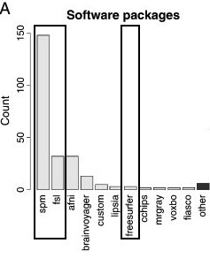

## Overview of Work/Research

- Segmentation/Classification of Computed Tomography (CT) scans
    - Brain segmentation
    - Hemorrhage segmentation
- Neuroimaging and R: Neuroconductor

## Overview of Work/Research

- Segmentation/Classification of Computed Tomography (CT) scans
    - Brain segmentation
    - Hemorrhage segmentation
- Neuroimaging and R: Neuroconductor

# Neuroimaging Analysis in Stroke

## The MISTIE Stroke Trial 

* Minimally Invasive Surgery plus r-tPA for Intracerebral Hemorrhage Evacuation (<strong>MISTIE</strong>) 
    - Multi-center, multi-national Phase II clinical trial
    - Alteplase (donated by Genentech)
* Patients with intracerebral hemorrhages (≥ 20 millilters)

PI: Dr. Dan Hanley

* http://braininjuryoutcomes.com/mistie-about

## When I say "stroke" I don't mean ischemic

- Ischemic stroke - clot blocks oxygen/nutrients
- Tissue dies
- ≈87% of strokes

Image from <a href = "http://www.strokecenter.org/patients/about-stroke/ischemic-stroke/
" style ="word-wrap: break-word;" >http://www.strokecenter.org/patients/about-stroke/ischemic-stroke/
</a>

## When I say "stroke" I don't mean ischemic

- Ischemic stroke - clot blocks oxygen/nutrients
- Tissue dies
- ≈87% of strokes

Image from <a href = "http://www.strokecenter.org/patients/about-stroke/ischemic-stroke/
" style ="word-wrap: break-word;" >http://www.strokecenter.org/patients/about-stroke/ischemic-stroke/
</a>

## Intracranial/Intracerebral Hemorrhage

- When a blood vessel ruptures into:
    + **Tissue ⇒ intracerebral hemorrhage (ICH)**
- ≈ 13% of strokes

<a href = "http://www.heartandstroke.com/site/c.ikIQLcMWJtE/b.3484153/k.7675/Stroke__Hemorrhagic_stroke.htm" style ="word-wrap: break-word;" >http://www.heartandstroke.com/site/c.ikIQLcMWJtE/b.3484153/k.7675/Stroke__Hemorrhagic_stroke.htm</a>

## X-ray Computed Tomography (CT) Scans

Images are acquired from an X-ray scanner.  
x-ray goes around object and detector the other side of the object determines how many x-rays are recovered 
- fancy transform
- Image!

Image from http://www.cyberphysics.co.uk/topics/medical/CTScanner.htm

 

## Image Representation: voxels (3D pixels)

 

Muschelli, John, Elizabeth Sweeney, and Ciprian Crainiceanu. "brainR: Interactive 3 and 4D Images of High Resolution Neuroimage Data." R JOURNAL 6.1 (2014): 42-48.

## Terminology: Neuroimaging to Data/Statistics

* Segmentation ⇔ classification 
* Image ⇔ 3-dimensional array
    - composed of voxels
* Mask/Region of Interest ⇔ binary (0/1) image 
* Registration ⇔  Spatial Normalization/Standarization
    - "Lining up" Brains

# Brain Segmentation of CT Scans

## Problem: CT Scans Capture **Everything**

## Brain Segmentation of CT Scans

Want to go from an image:

 

## Brain Segmentation of CT Scans

Want to go from an image:

 
To a brain-extracted image:

## Publicly Available Code

* Muschelli, John, et al. "Validated automatic brain extraction of head CT images." NeuroImage 114 (2015): 379-385. 
* R code: http://bit.ly/CTBET_RCODE - based on **fslr** 
* bash code: http://bit.ly/CTBET_BASH

# Larger ICH Volume ⇒ Worse Outcome

## ICH Segmentation, Volume/Location Estimation 

Want to go from a brain image:

 
To a binary hemorrhage mask:

## Subject Data used: 111 scans (1 Per Patient)

----------------------------------------------
&nbsp;                                 Overall
-------------------------------- -------------
Age in Years: Mean (SD)            60.8 (11.2)

Male: N (%)                         76 (68.5%)

Reader-Based Clot Location (%)                

&nbsp;&nbsp;&nbsp;Putamen            68 (61.3)

&nbsp;&nbsp;&nbsp;Lobar              33 (29.7)

&nbsp;&nbsp;&nbsp;Globus              6 ( 5.4)
Pallidus                                      

&nbsp;&nbsp;&nbsp;Thalamus            4 ( 3.6)

ICH Volume in mL: Mean (SD)        37.4 (20.1)
----------------------------------------------

- Adults (inclusion criteria 18-80 years old)
- Mostly males
- Reader-classified Location of Hemorrhage

## Step 1: Create Predictors of ICH   

## Data Structure for One Patient     

---

 

 
  <h2>Step 2: Aggregate Data</h2>
  Training Data Structure
  
  * Stack together 10 randomly selected patients
  * Train model/classifier on this design matrix

  
  
    
  

    
  
 

## Step 3: Fit Models / Classifier

Let $y_{i}(v)$ be the presence / absence of ICH for voxel $v$ from person $i$.  

General model form: 
$$
 P(Y_{i}(v) = 1)  \propto f(X_{i}(v))
$$

## Models Fit on the Training Data

- Logistic Regression: \(f(X_{i}(v)) = \text{expit} \left\{ \beta_0 + \sum_{k= 1}^{p} x_{i, k}(v)\beta_{k}\right\}  \)
- Generalized Additive Model (Hastie, et al., 1990) 
    - fit using thin plate splines
- LASSO (Tibshirani, 1996; Friedman, et al., 2010): 
$$ \mathcal{L}\left(\left.Y_{i}(v) \right|\, f(X_i(v))\right) \propto \beta_0 + \sum_{k= 1}^{p} x_{i, k}(v) \beta_{k} + \lambda \sum_{k= 1}^{p} \left|\beta_{k}\right|
$$
- Random Forests (Liaw, et al., 2002; Breiman, 2001)

\(f(X_{i}(v)) \propto\) 

## Predicted Volume Estimates True Volume 

## Predicted Volume Estimates True Volume 

## Patient with Median Overlap in Validation Set

 

## Shiny Application  [http://johnmuschelli.com/ich_segment.html](http://johnmuschelli.com/ich_segment.html) 

## Conclusions of Stroke Analyses

- We can segment ICH volume from CT scans   

---- 

 

 
  <h2>Workflow for the Analysis</h2>
  
    
  

  

----

 

 
  <h2>Workflow for the Analysis</h2>
  
    
  

  

#  Neuroconductor:   A Neuroimaging R Repository   Hosted on GitHub and  Checked by Travis CI

----

 

 
  <h2>Neuroconductor Goal: <h2>
  Lower the bar to entry - just R
  
    
  

  

## (A Lot of) Software Choices for fMRI Analysis 

<!--  -->

From Carp, Joshua. "The secret lives of experiments: methods reporting in the fMRI literature." Neuroimage 63.1 (2012): 289-300.

## Number of Downloads (My CRAN packages)

From the `cranlogs` R package (as of October 10, 2016):

 
   

<!--html_preserve-->

<!--/html_preserve-->

   

    
  
 

----

 

 
  <h2>Neuroconductor Goal: </h2>
  
  

  Provide package checks/rules/**stability** 
  
  - check against other imaging software (e.g. FSL)
  

    
  

  
 From [https://memegenerator.net/instance/51553268](https://memegenerator.net/instance/51553268).
  

  

----

 

 
  <h2>Neuroconductor Goal: </h2>
  
  

  R **Data** packages for testing
  
  - images can be big 
  - use package system
  
  

    
  
 

  
 From [https://memegenerator.net/Everywhere-Toy-Story](https://memegenerator.net/Everywhere-Toy-Story).
  

  

----

 

 
  <h2>Neuroconductor Goal: </h2>
  
  

  Detailed **tutorials** on how to actually perform an analysis
  
  See [http://johnmuschelli.com/neuroc/](http://johnmuschelli.com/neuroc/)
  
  

    

 

  
 From [http://i.imgur.com/0Y1xISa.gifv](http://i.imgur.com/0Y1xISa.gifv).
  

  

----

 

 
  <h2>Neuroconductor Goal: </h2>
  
  

  
  Allow neuroimaging to use all the things R has to offer
  
  - versioning and testing
  - markdown and reproducibility
  - statistics
  - Shiny
  
  

    

 

  
 From [https://memegenerator.net/X-All-The-Things/caption](https://memegenerator.net/X-All-The-Things/caption).
  

  

## Neuroconductor 

Problems

1.  More control over the workflow = more work (**for us statisticians**!)
2.  Users need external software (versions/installation)
3.  No control over external software
    - if maintainer changes something, not much recourse
4.  Need the content (buy-in from the community)

## How do I get started?

 
   

   
Neuroconductor Content:
[http://johnmuschelli.com/neuroc/](http://johnmuschelli.com/neuroc/)

Coursera Course: 
Introduction to Neurohacking In R

[https://www.coursera.org/learn/neurohacking/](https://www.coursera.org/learn/neurohacking/)

   

   

# Thanks

## Under Development R Packages

1.  nitrc - download data from the **NITRC repository**
2.  MNITemplate$^*$ - data of a population-level "template" image
3.  EveTemplate$^*$ - data of a different template image
4.  kirby21 - data package with 2 subjects, 2 visits with multimodal imaging
5.  rcamino - interface to analyze DTI data
6.  msseg - MS lesion segmentation 
7.  extrantsr - pipelines for structural imaging analysis

Not started yet

8.  hcp - interface with Human Connectome Project
9.  afnir - R port of AFNI software (No. 2 on the chart)

$^*$ - working with Jean-Philippe Fortin on these

