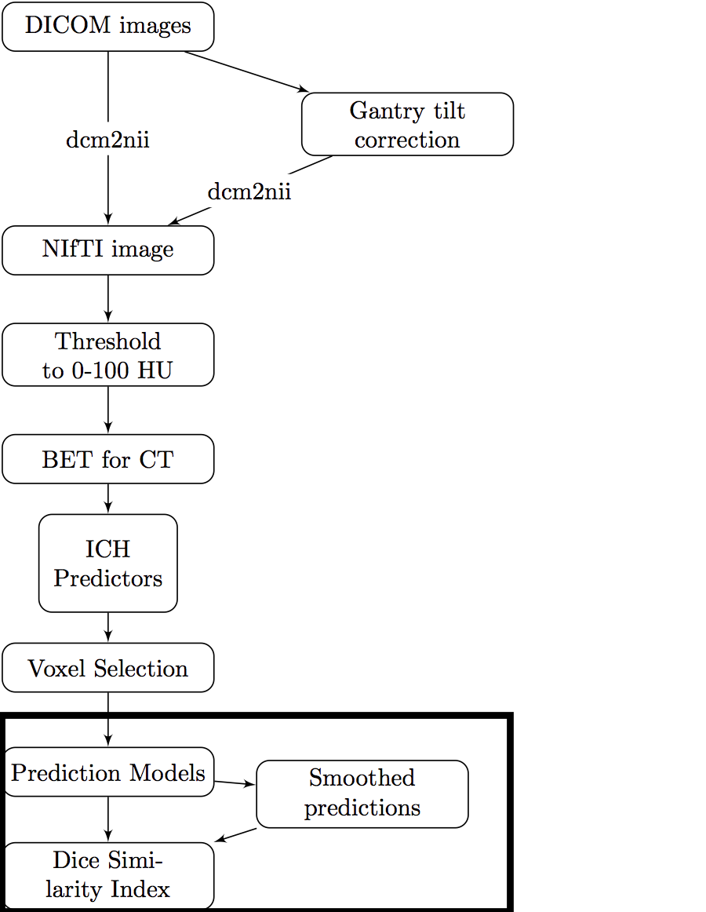

```{r opts, prompt=FALSE, echo=FALSE, message=FALSE, warning=FALSE, error=FALSE, comment=""}
library(knitr)
library(knitcitations)
opts_chunk$set(echo = FALSE, prompt = FALSE, message = FALSE, warning = FALSE, comment = "", results = 'hide')
```


## Stroke Segmentation in CT Scans

<div class="container">
   <div class="left-half">

   </div>
   <div class="right-half">

</div>
</div>

## Shiny Application 


## 

## 


## (A Lot of) Software Choices for fMRI Analysis 


<!--  -->

From Carp, Joshua. "The secret lives of experiments: methods reporting in the fMRI literature." Neuroimage 63.1 (2012): 289-300.


## Number of Downloads (My CRAN packages)

From the `cranlogs` R package:


```{r, cache = TRUE}
if (!require(cranlogs)) {
  library(devtools)
  install_github("metacran/cranlogs")
}
first_date = "2014-01-10"
today = Sys.Date()
long_today = format(Sys.time(), "%B %d, %Y")
packs = c("fslr", "brainR", "matlabr", "spm12r", "WhiteStripe", "oasis", "freesurfer", "papayar")
last_week = cran_downloads( when = "last-week",
                            packages = packs)
last_week = ddply(last_week, .(package), summarise, 
                  Last_Week = sum(count))
dl = cran_downloads( from = first_date, to = today,
                     packages = packs)
dl = ddply(dl, .(package), summarise, All_Time = sum(count))
dl = merge(dl, last_week)
dl = plyr::arrange(dl, desc(Last_Week))
colnames(dl) = c("Package", "All Time", "Last Week")
```

```{r}
library(DT)
```

```{r, results = "asis", eval = TRUE}
datatable(dl, filter = "none", selection = "none", rownames = FALSE,
          options = list(dom = 't', autoWidth = TRUE,
                         columnDefs = list(list(
                           className = 'dt-center',
                           targets = 0)))
)
```

## R Package Interfaces with Imaging Software


#  Neuroconductor: <br> A Neuroimaging R Repository <br> Hosted on GitHub and <br>Checked by Travis CI

## 

## Neuroconductor Goals (Similar to BioC)

<div style='font-size: 24pt;'>

1.  Lower the bar to entry - just have to know R
    - more packages to **interface** with other programs 
2.  All the things a repository has (checks/rules/**stability**)
    - additional checks with imaging software installed (e.g. examples)
3.  **Data** packages to test packages with real data (images can be big)
4.  Detailed **vignettes/tutorials** on how to actually perform an analysis
5.  Image analyses use all the "things R has to offer" (packaging system/**reproducibility**/etc.)

</div>


## Under Development R Packages

1.  nitrc - download data from the **NITRC repository**
2.  MNITemplate$^*$ - data of a population-level "template" image
3.  EveTemplate$^*$ - data of a different template image
4.  kirby21 - data package with 2 subjects, 2 visits with multimodal imaging
5.  rcamino - interface to analyze DTI data
6.  msseg - MS lesion segmentation 
7.  extrantsr - pipelines for structural imaging analysis

Not started yet

8.  neurohcp - interface with Human Connectome Project
9.  afnir - R port of AFNI software (No. 2 on the chart)

$^*$ - working with Jean-Philippe Fortin on these


## Neuroconductor 

Hopeful Solutions

1.  Help improve reproducibility in imaging
2.  Standardize the syntax / R objects for imaging a bit (I'm realistic)
3.  Easily-accessible content

Problems

1.  More control over the workflow = more work (**for us**!)
2.  Users need external software (versions/installation)
3.  No control over external software
4.  Need the content (buy-in from the community)


# Thanks


## Current R Capabilities in Imaging

<div class="columns-2">


1.  **Image I/O**
2.  **Plotting**
3.  Image registration (linear/non-linear)
9.  **Image smoothing**
4.  **Tissue-class segmentation (white/gray/CSF)**
5.  Inhomogeneity correction
6.  **Intensity normalization**


7.  Temporal filtering
8.  Large linear models
9.  Analysis of fMRI task data
10.  Diffusion tensor models


</div>
