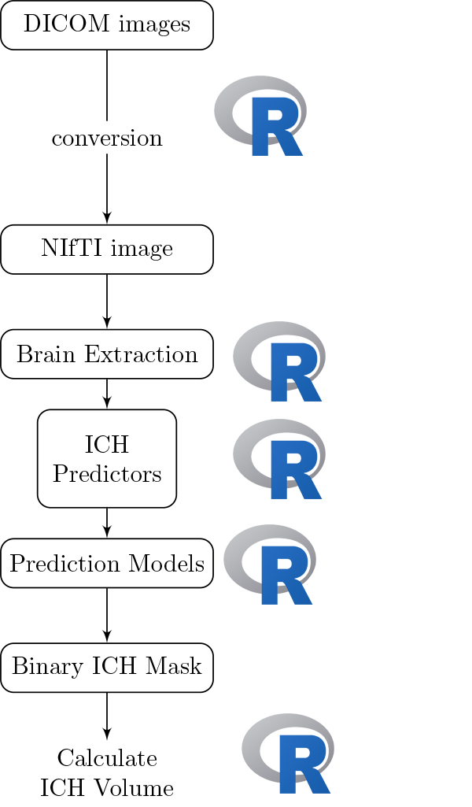

# Neuroconductor: Why

<script type="text/x-mathjax-config">
MathJax.Hub.Config({ TeX: { extensions: ["color.js"] }});
</script>

```{r opts, prompt=FALSE, echo=FALSE, message=FALSE, warning=FALSE, error=FALSE, comment=""}
library(knitr)
library(knitcitations)
cite_options(max.names = 1)
opts_chunk$set(echo = FALSE, prompt = FALSE, message = FALSE, warning = FALSE, comment = "", results = 'hide')
```

```{r}
library(RefManageR)
library(knitcitations)
bib <- ReadBib('Oral_Proposal.bib')
x = sapply(bib, citep)
```

----
<div class="container"> 
<div id="left_col2"> 
  <h2>Workflow for the Analysis</h2>
<div style='font-size: 32pt;'>
  
Multiple pieces of software used

  - all different syntax
</div>
  </div>    
  <div id="right_col2">

  </div>
</div>


## It's typical to have lots of software choices


<!--  -->

From Carp, Joshua. "The secret lives of experiments: methods reporting in the fMRI literature." Neuroimage 63.1 (2012): 289-300.


```{r, cache = TRUE}
library(tableone)
library(pander)
library(plyr)
if (!require(cranlogs)) {
  devtools::install_github("metacran/cranlogs")
}
first_date = "2014-01-10"
today = Sys.Date()
long_today = format(Sys.time(), "%B %d, %Y")
packs = c("fslr", "brainR", "matlabr", "spm12r", "WhiteStripe", "oasis", "freesurfer", "papayar")
last_week = cran_downloads( when = "last-week",
                            packages = packs)
last_week = plyr::ddply(last_week, .(package), summarise, 
                  Last_Week = sum(count))
dl = cran_downloads( from = first_date, to = today,
                     packages = packs)
dl = ddply(dl, .(package), summarise, All_Time = sum(count))
dl = merge(dl, last_week)
dl = plyr::arrange(dl, desc(Last_Week))
colnames(dl) = c("Package", "All Time", "Last Week")
made_packs = c("fslr", "spm12r", "freesurfer")
made_packs = dl$Package[ dl$Package %in% made_packs] 
dl$Package[ dl$Package %in% made_packs] = paste0("<strong>", made_packs, "</strong>")
```


#  What: <br> An R Platform for <br> Medical Imaging Analysis


----
<div class="container"> 
<div id="left_col2"> 
  <h2>Goal: </h2>
<div style='font-size: 24pt;'>
  
Lower the bar to entry 

- all R code
    - pipeline tool
    - "native" R code

Complete pipeline
  
  - preprocessing and analysis
</div>
  </div>    
  <div id="right_col2">

  </div>
</div>


## Current Progress (my R packages)

Number of downloads as of `r format(today, format="%B %d, %Y")` (`cranlogs` package):

<div class="container"> 
   <div class="left-half">

```{r, results = "asis", eval = TRUE}
DT::datatable(dl, filter = "none", selection = "none", rownames = FALSE,
          options = list(dom = 't', autoWidth = TRUE,
                         columnDefs = list(list(
                           className = 'dt-center',
                           targets = 0))),
          escape = FALSE
)
```
</div>
   <div class="right-half">
    
  </div> 
</div>


----
<div class="container"> 
<div id="left_col2"> 
  <h2>Goal: </h2>
<div style='font-size: 28pt;'>
  
Centralize the packages
  
- [Medical Imaging Task View](https://cran.r-project.org/web/views/MedicalImaging.html) 
    - no tutorials
- [Neuroconductor Repository](https://github.com/neuroconductor/)
  </p>
</div>   
</div>    
  <div id="right_col2">

  <p style='font-size: 12pt;'> From [https://imgflip.com/memegenerator/Grandma-Finds-The-Internet](https://imgflip.com/memegenerator/Grandma-Finds-The-Internet).
  </p>
  </div>
</div>

----
<div class="container"> 
<div id="left_col2"> 
<h2>Neuroconductor Goal: </h2>

<div style='font-size: 28pt;'>

Detailed **tutorials** on how to actually perform an analysis  

</br>

- [http://johnmuschelli.com/neuroc/](http://johnmuschelli.com/neuroc/)  

</div> 
</div>    
<div id="right_col2">

<p style='font-size: 10pt;'> From [http://i.imgur.com/0Y1xISa.gifv](http://i.imgur.com/0Y1xISa.gifv).
</p>
</div>
</div>


----
<div class="container"> 
<div id="left_col2"> 
  <h2>How: </h2>
  
<div style='font-size: 28pt;'>
  
Provide package checks / rules / **stability** 
  
- check against other imaging software (e.g. FSL)

</div> 
  </p>
</div>    
  <div id="right_col2">
  
  
  
   
  
  <!--   -->

  <!--     -->

  <!--     -->

<!--  -->
<!--   <p style='font-size: 12pt;'> From [https://memegenerator.net/instance/51553268](https://memegenerator.net/instance/51553268). -->
<!--   </p> -->
  </div>
</div>


## How: Website

- Tutorials in RMarkdown
- Adi Gherman made a lot of the website: https://neuroconductor.org/
    - Also programmed most of the current backend
    - Development version of the backend exists (all R): https://github.com/muschellij2/neuro_backend
- `git2r`, `gh`, `travisci`, and `devtools` packages 


##  Neuroconductor Downsides

<div style='font-size: 28pt;'>

1.  More control over the workflow = more work
2.  Users need external software (versions/installation)
3.  No control over external software
    - if maintainer changes something, not much recourse
4.  Need the content (buy-in from the community)

</div>

## Try it out

A short course we made with Neuroconductor packages:
http://johnmuschelli.com/imaging_in_r/

How to set up
http://johnmuschelli.com/imaging_in_r/installing_everything_locally/


