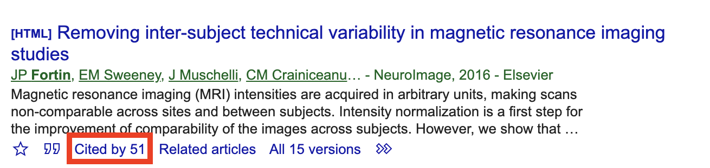
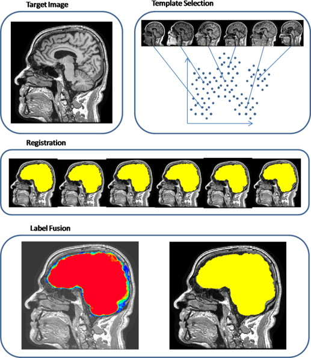

<style type="text/css">
article {
  font-size: 30pt;
}
</style>

<!-- 20 mintue talk!!!!!!! -->

```{r setup, include=FALSE, message = FALSE}
knitr::opts_chunk$set(echo = FALSE, prompt = FALSE, message = FALSE, warning = FALSE, comment = "", results = 'hide')
library(pander)
library(rvest)
library(httr)
library(neurobase)
library(matlabr)
library(spm12r)
```

# (Bio)Statisticians are **LATE** to the neuroimaging game

----

- Engineers got there first, a lot MRI started in engineering (also, there are more of them)
- MATLAB reigned supreme
  - Cost, closed source had issues, also...the language (ever tried to read a CSV?) 
- Python is stepping in: Nipy (also great logos)

```{r, out.width="80%", results='markup'}
knitr::include_graphics("figures/nipy.png")
```

----

<h2>Movie: Margin Call </h2>

> There are three ways to make a living in this business: be first; be smarter; or cheat.

```{r, out.width="20%", results='markup'}
knitr::include_url("https://www.youtube.com/embed/ag14Ao_xO4c")
```

# If you can't be first, be different.  Also ... steal

# R is a language and environment <br>for **statistical** computing <br>and graphics. <br> https://cran.r-project.org/

# Should read "R **started as** ..."

## What does R have for medical imaging?

  <p style='font-size: 12pt;'> [https://imgflip.com/memegenerator/Grandma-Finds-The-Internet](https://imgflip.com/memegenerator/Grandma-Finds-The-Internet)
  </p>  


## What does R have for medical imaging?

  


## Envy: Bioconductor<br>  

- centralized bioinformatics packages (> 1300)
- large community/developer team
- published tutorials and workflows 
- additional requirements to CRAN (e.g. packages need vignettes)

## Why should you care?

- Students see resources - "I can learn genomics with Bioconductor easier than imaging"
- Researchers see analyses - "That's the analysis I want to do, ready made"
- Papers with software get **cited more**
  - Usually 1 paper for analysis/demonstration and 1 for software
- All of these lead to **funding**


# There is Enough Space for Python and R, but we need our **niche(s)**

## Where is the niche for R/(Bio)statisticians?

- **Medical** imaging, not just **neuro**imaging
  - lungs, livers, oh my!
- Not just MRI: CT, PET, EEG, etc.
- Mixed effects and longitudinal modeling
- <p style='font-size: 32pt;'>Data Harmonization</p>
  - Steal from genomics
  - Steal (aka adapt) from Bioconductor

  
----

```{r, results='markup', out.width="80%"}

knitr::include_graphics("figures/ComBat_citations.png")
knitr::include_graphics("figures/Combat_cortico_citations.png")
```


# <br> An R Platform for <br> Medical Imaging Analysis

```{r, cache = TRUE, echo = FALSE, results='hide'}
url = httr:::GET("https://neuroconductor.org/list-packages/all")
cr = content(url)
tab = html_table(cr)[[1]]
sort(unique(tab$Maintainer))
n_maintainers = length(unique(tab$Maintainer))
nr = nrow(tab)
```

## What is Neuroconductor?

1.  A centralized repository of packages (N = `r nr`)
2.  A community of developers (N = `r n_maintainers`) and users
3.  A website [https://neuroconductor.org/](https://neuroconductor.org/).
    - with tutorials and help
4.  A team helping developers and users 
5.  Set of packages to allow R to perform processing.

## Benefits of Neuroconductor

<div style='font-size: 32pt;'>
  
Allow imaging to use all `R` has to offer:
  
- Statistics and Machine Learning (`tensorflow`)
- Versioning and testing (`GitHub`)
- Reproducible reports and analyses
- Shiny (web applications)
- Genomics/Imaging analysis in one platform
    - Bioconductor
  
</div>

## Package Features: Image Registration

- ANTsR, RNiftyReg, fslr

```{r, out.width="100%", results="markup", fig.align="center"}
knitr::include_graphics("figures/Reg_Figure_Option1_nonlinear_short.png")
```

## Package Features: Inhomogeneity Correction

- ANTsR, fslr

```{r, out.width="75%", results="markup", fig.align="center"}
knitr::include_graphics("figures/MRI_Bias_Field_Correction_Slicer3_close_up_inhomogeneity.png")
```
<div  style="font-size: 10pt;">
Image From https://www.slicer.org/w/images/7/77/MRI_Bias_Field_Correction_Slicer3_close_up.png
</div>

## Package Features: Intensity Normalization

<div class="container" style="margin-top: -60px;"> 
   <div class="left-half2" style="font-size: 24pt;">

- WhiteStripe - https://github.com/muschellij2/whitestripe
- RAVEL - https://github.com/Jfortin1/RAVEL
- ComBat - https://github.com/Jfortin1/ComBatHarmonization
</div>

  <div class="right-half2" style="font-size: 28pt;">
```{r, out.width="75%", results="markup", fig.align="center"}
knitr::include_graphics("figures/whitestripe.jpg")
```
  </div>
  <div  style="font-size: 10pt;">
  Figure from Shinohara, Russell T., et al. "Statistical normalization techniques for magnetic resonance imaging." NeuroImage: Clinical 6 (2014): 9-19.
  </div>  
</div>


## Package Features: Smoothing

- fslr, ANTsR, AnalyzeFMRI

```{r, out.width="100%", results="markup", fig.align="center"}
knitr::include_graphics("figures/smooth_example.png")
```

## Package Features: Data

<div class="container" style="margin-top: -30px;"> 
   <div class="left-half" style="font-size: 20pt;">

- neurohcp - [Human Connectome Project](https://www.humanconnectome.org/)
- kirby21.t1, kirby21.fmri - https://www.nitrc.org/projects/multimodal
- nitrcbot - https://www.nitrc.org/
- Rxnat - XNAT databases

  </div>
  <div class="right-half" style="font-size: 20pt;">

Multi-Atlas Label Fusion (MALF) 

- malf.templates - https://github.com/muschellij2/malf.templates

```{r, out.width="70%", results="markup", fig.align="center"}

```
  </div>
</div>


----
<div class="container"> 
<div id="left_col2"> 
<h2>Neuroconductor Goal: </h2>

<div style='font-size: 28pt;'>

Detailed **tutorials** on how to actually perform an analysis  

</div> 
</div>    

<div id="right_col2">

<p style="font-size: 10pt;"> From [http://i.imgur.com/0Y1xISa.gifv](http://i.imgur.com/0Y1xISa.gifv).
</p>
</div>
</div>

</br></br></br></br>
</br></br></br></br>
<div class="container" style="width:100%">
http://johnmuschelli.com/neuroc
</div>

## Training we are providing

<div class="container"> 
   <div class="left-half" style="font-size: 28pt;">
   Coursera Course: Introduction to Neurohacking In R 
  </div>
  <div class="right-half" style="font-size: 28pt;">
  
  </div>
  </br></br></br></br>
https://www.coursera.org/learn/neurohacking/

<div style="font-size: 28pt;">
  http://johnmuschelli.com/imaging_in_r/
</div>
</div>

## Things in the Works/Other work

<div class="container"> 
   <div class="left-half" style="font-size: 28pt;">
   
  - https://github.com/ANTsXNet - Wide array of deep learning applications for R
  - https://github.com/msharrock/deepbleed - CNN for ICH Segmentation
  
  - EEG - https://github.com/craddm/eegUtils
  </div>
  <div class="right-half" style="font-size: 28pt;">
  
  </div>
</div>


## Questions?


Submit Packages at: https://neuroconductor.org/submit-package

Funding: NIH 2R01NS060910 and U24HG010263

